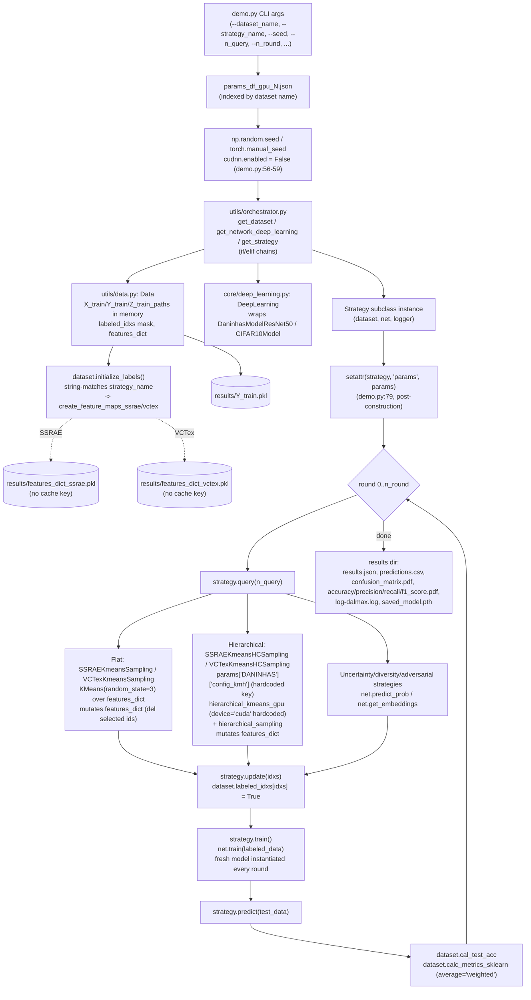

# Architecture — Current State

Status: honest snapshot of the code as of 2026-08-23 (commit `ed37f8a`, branch
`refactor/phase-2-core`; Phase 2 of `refactor-plan.md` has landed). This document
originally described the pre-refactor `demo.py`-centric design; §0 below records what actually
changed once Phase 2 landed. The rest of the document (§1-§7) is now a description of the
**legacy code paths that the new `dalmax/` package wraps or bypasses**, not of the live entry
point — read §0 first. See `target-architecture.md` for the design target and how much of it has
landed, and `refactor-plan.md` for the phase plan.

## 0. Phase 2 status (2026-08-23)

`demo.py` no longer contains any logic — it is a 12-line shim (`from dalmax.cli import main`) kept
only so existing invocations (`python demo.py ...`, `run_pipe_gpu_0.sh`/`_1.sh`, the `Makefile`'s
`smoke` target) keep working unchanged. All CLI parsing, config loading, the round loop, and
reporting now live in the new top-level package `dalmax/` (`dalmax/cli.py`,
`dalmax/config/{schema,loader}.py`, `dalmax/experiment/{runner,reporter,run_metadata}.py`,
`dalmax/embeddings/*`, `dalmax/selection/*`, `dalmax/query_strategies/*`,
`dalmax/data/registry.py`, `dalmax/models/registry.py`, `dalmax/seeding.py`).

`core/` and `utils/` were **left in place, unmodified except `utils/data.py`** (per ADR 0002: the
physical package consolidation is still deferred to Phase 4). Two consequences:

- Every model class (`core/daninhas_model.py`, `core/cifar10_model.py`), the training engine
  (`core/deep_learning.py`), the dataset loaders (`utils/data.py: get_DANINHAS`/`get_CIFAR10`), the
  torch `Dataset` handlers (`utils/dataset.py`), and the 12 non-representation strategy classes
  (`core/query_strategies/{random_sampling,least_confidence,margin_sampling,entropy_sampling,
  *_dropout,kmeans_sampling,kcenter_greedy,bayesian_active_learning_disagreement_dropout,
  adversarial_bim,adversarial_deepfool}.py`) are **vendored/wrapped, not rewritten** — `dalmax`
  constructs and calls them directly (`dalmax/models/registry.py`, `dalmax/data/registry.py`,
  `dalmax/query_strategies/registry.py:LEGACY_STRATEGY_REGISTRY`).
- `utils/orchestrator.py` and four files it used to feed strategy instances from
  (`core/query_strategies/ssrae_kmeans_sampling.py`, `core/query_strategies/vctex_kmeans_sampling.py`,
  `core/query_strategies/ssl_ssrae_sampling.py`) are now **dead code**: nothing reachable from
  `demo.py`/`dalmax.cli` imports `utils/orchestrator.py` any more (verified: no `import
  utils.orchestrator`/`from utils import orchestrator`/`from utils.orchestrator import ...` outside
  `tests/test_registry.py`, which tests the orphaned module directly for its own sake). The four
  legacy `*Kmeans*Sampling`/`SSLStrategy` CLI names still work exactly as before, but are now served
  by `dalmax/query_strategies/representation.py:RepresentationStrategy` presets
  (`dalmax/query_strategies/registry.py:REPRESENTATION_PRESETS`), not by these classes. Likewise
  `Data.create_feature_maps_ssrae`/`create_feature_maps_vctex` (`utils/data.py`) are only reachable
  when `Data.initialize_labels`'s new `compute_legacy_features` flag is `True` — `dalmax`'s
  `ExperimentRunner` always calls it with `False` (`dalmax/experiment/runner.py::run`), so these
  two methods, along with `utils/orchestrator.py` and the three strategy files above, are dead code
  from `dalmax.cli`'s point of view. All five are scoped for deletion in Phase 4
  (`refactor-plan.md` Phase 4 scope list) — kept for now only because Phase 2 policy
  (ADR 0002) is "wrap, don't delete, until Phase 4."
- `results/features_dict_ssrae.pkl`/`results/features_dict_vctex.pkl` (the original fixed-path
  pickle caches, already superseded once by the Phase 1 `cache_file_path` keying) are now doubly
  orphaned: neither the Phase 1 `utils/data.py::cache_file_path` path nor the Phase 2
  `dalmax/embeddings/cache.py::EmbeddingCache` path reads or writes them. They remain on disk,
  untouched, not deleted (`.claude/rules/data-safety.md`: never delete `results/` content
  automatically) — see `known-issues.md` KI-3.

See `target-architecture.md` §"What landed vs. what remains" for the package-layout diff against
the Phase 4 target, and `refactor-plan.md` Phase 2's acceptance criteria for the itemized checklist.

## 1. Module map (legacy layer — still the implementation `dalmax` wraps)

| Area | File(s) | Responsibility today |
|---|---|---|
| **CLI entry point (Phase 2, live)** | `demo.py` (12-line shim) → `dalmax/cli.py` | `demo.py` only calls `dalmax.cli.main()`; `dalmax/cli.py` does argparse (same flags plus `--device`/`--embedding_variant`), builds an `ExperimentConfig` via `dalmax.config.loader`, and delegates to `dalmax.experiment.runner.ExperimentRunner` + `dalmax.experiment.reporter.write_report` |
| Secondary/dead entry point | `demo_ssl.py` | prints "Hello from SSL demo_ssl.py" and imports `core/tools/SSL/code_kmh.py`; not wired to any CLI flag, not part of the experimental protocol |
| **Dead as of Phase 2** — registries (if/elif) | `utils/orchestrator.py` | `get_handler`, `get_dataset`, `get_network_deep_learning`, `get_strategy` — four if/elif chains; unreachable from `demo.py`/`dalmax.cli` since Phase 2 (see §0), superseded by `dalmax/{data,models,query_strategies}/registry.py`; kept only for `tests/test_registry.py`'s own coverage of the legacy path, scheduled for deletion in Phase 4 |
| Dataset loading + feature caching | `utils/data.py` | `Data` class (in-memory pool + labeled mask), `get_DANINHAS`, `get_CIFAR10`, `get_CIFAR10_Download`; also owns SSRAE/VCTex feature extraction and pickle caching, t-SNE plotting. Phase 2 additions: `initialize_labels(..., compute_legacy_features: bool = True)` (§0) and `calc_metrics(preds) -> dict` (weighted + macro precision/recall/F1, used by `dalmax.experiment.runner`) |
| Torch `Dataset` handlers | `utils/dataset.py` | `DANINHAS_Hander`, `CIFAR10_Handler` — image transforms + `(x, y, index)` tuples |
| Training/inference engine | `core/deep_learning.py` | `DeepLearning` wraps a model class; `train`, `predict`, `predict_prob`, `predict_prob_dropout(_split)`, `get_embeddings`, `save_model`, `load_model` (marked `# TODO: FIX THIS`) |
| Classifier architectures | `core/daninhas_model.py` (ResNet50 + unused ViT-B/16 variant), `core/cifar10_model.py` (small CNN) | `forward()` returns `(logits, embedding)` tuple used by both training and embedding-based strategies |
| Strategy base class | `core/query_strategies/strategy.py` | `Strategy` — query/update/train/predict/info/save_model/plot_selected_images |
| Uncertainty strategies | `least_confidence.py`, `margin_sampling.py`, `entropy_sampling.py`, `*_dropout.py`, `bayesian_active_learning_disagreement_dropout.py` | classic AL baselines from the `deepALplus`-style lineage |
| Diversity strategies | `kmeans_sampling.py`, `kcenter_greedy.py` | operate on `net.get_embeddings()` (ResNet penultimate layer), no dataset coupling |
| Adversarial strategies | `adversarial_bim.py`, `adversarial_deepfool.py` | batched GPU-capable perturbation-distance ranking |
| **Dead as of Phase 2** — RNHAL representation (flat) | `ssrae_kmeans_sampling.py` (`SSRAEKmeansSampling`), `vctex_kmeans_sampling.py` (`VCTexKmeansSampling`) | flat k-means over `dataset.features_dict`, k = n_query, pick closest-to-centroid sample per cluster, hardcoded `KMeans(random_state=3)` (KI-5/KI-29). Unreachable from `demo.py`/`dalmax.cli` since Phase 2: the CLI names `SSRAEKmeansSampling`/`VCTexKmeansSampling` are now served by `dalmax.query_strategies.representation.RepresentationStrategy` (preset `extractor=ssrae\|vctex`, `selection=flat_closest`, seeded from `--seed`) — see `dalmax/selection/flat_kmeans_closest.py` for the fixed, seeded replacement. Still exported from `core/query_strategies/__init__.py` and importable directly; scheduled for deletion in Phase 4 |
| **Dead as of Phase 2** — RNHAL representation (hierarchical) | `ssl_ssrae_sampling.py` (`SSLStrategy` base, `SSRAEKmeansHCSampling`, `VCTexKmeansHCSampling`) | hierarchical k-means + hierarchical resampling over `dataset.features_dict`, hardcoded `self.params['DANINHAS']` (KI-4) and `device="cuda"` (KI-13). Unreachable from `demo.py`/`dalmax.cli` since Phase 2: served by `dalmax.query_strategies.representation.RepresentationStrategy` (preset `selection=hierarchical`) → `dalmax/selection/hierarchical_kmeans.py::HierarchicalKMeansSelection`, which takes device and hierarchy from `ExperimentConfig`, not a hardcoded key. Scheduled for deletion in Phase 4 |
| SSRAE feature extractor | `core/tools/SSRAE/extractor.py` (`ColorFeatureExtractor`), `core/tools/SSRAE/rnn.py` (`RNN`), `core/tools/SSRAE/splitter.py` (`WindowSplitter`, not read in this pass) | randomized-network spatio-spectral texture representation, output = `hstack[β_R, β_G, β_B, β_S_R, β_S_G, β_S_B]` (6 equal-shape blocks, **row-interleaved by the final reshape, not contiguous** — see `.specs/experiments/ablation-study.md` §6.1 Layout caveat) |
| VCTex feature extractor | `core/tools/VCTex/VCTexMethod.py` (not read in this pass, referenced from `utils/data.py:10,73`) | alternative color-texture representation, `Q=[5,17]` |
| Hierarchical k-means / sampling (vendored from Meta DINOv2 SSL) | `core/tools/SSL/src/hierarchical_kmeans_gpu.py`, `core/tools/SSL/src/hierarchical_sampling.py`, `core/tools/SSL/src/clusters.py`, `core/tools/SSL/src/kmeans_gpu.py` (not read) | GPU k-means with resampling steps, `HierarchicalCluster` bookkeeping, budget-aware recursive sampling |
| Logging | `utils/LOGGER.py` | module-level singleton logger; writes to `results/logs/<timestamp>-log-dalmax.log`, later renamed by `demo.py` into the run's results directory |
| Reporting (post-hoc) | `utils/report/1_cm_extract_from_pdf.py` … `4_report_build_average_results.py`, `build_method_metrics.py`, `plot_results_dir.py` | separate numbered scripts that walk `results/` and aggregate metrics/confusion matrices across seeds |
| Params | `params_df_gpu_0.json`, `params_df_gpu_1.json` (identical schema, different `config_kmh`) | per-dataset hyperparameter dict keyed by dataset name string |
| Dead/experimental files | `temp_teste.py`, `test.py` (not a pytest file — ad-hoc CSV table builder), `TRASH_TEXT.md`, `sampled_data.pdf`, `core/query_strategies/old_functions.py` | not imported by `demo.py` or `utils/orchestrator.py`; safe to remove in Phase 4 |

## 2. Data flow (today)

1. `demo.py` parses CLI args (`--dir_results --params_json --seed --n_init_labeled --n_query --n_round --dataset_name --strategy_name`).
2. Loads the whole params JSON, indexes it by `args.dataset_name` (`demo.py:38-44`).
3. Builds the results directory path from `dir_results + data_dir_basename + SEED_.. + NQ_.._NIL_.._NR_.._NE_.. + strategy_name` (`demo.py:44-54`).
4. Sets global seeds and disables cuDNN (`demo.py:56-59`).
5. `utils.orchestrator.get_dataset(name, params)` → `utils/data.py:get_DANINHAS`/`get_CIFAR10` → walks `train/`/`test/` folders, builds a `Data` object holding all images in memory as `np.ndarray` plus `Y_train`/`Y_test`/paths.
6. `utils.orchestrator.get_network_deep_learning(name, device, params)` → `DeepLearning(ModelClass, params[name], device)`.
7. `utils.orchestrator.get_strategy(name)` → strategy class; instantiated as `strategy = StrategyClass(dataset, net, logger)`.
8. `setattr(strategy, "params", params)` (`demo.py:79`) injects the **full, un-indexed** params dict onto the strategy instance after construction.
9. `dataset.initialize_labels(n_init_labeled, strategy_name)` — random initial labeled pool; **also** triggers SSRAE/VCTex feature-map computation by string-matching `strategy_name` (`utils/data.py:220-229`).
10. Round 0: `strategy.train()` → `net.train(labeled_data)` (fresh model instantiated every call, see §3); `strategy.predict(test_data)`; metrics via `dataset.cal_test_acc` and `dataset.calc_metrics_sklearn` (average='weighted', not macro — see known-issues).
11. For `rd in 1..n_round`: `strategy.query(n_query)` → `strategy.update(idxs)` (flips `dataset.labeled_idxs`) → `strategy.train()` → `strategy.predict()` → metrics appended.
12. After the loop: confusion matrix + accuracy/precision/recall/F1 plots saved as PDFs, log file moved into the results dir, model saved (`strategy.save_model`), `results.json` and `predictions.csv` written.

### Mermaid flowchart



## 3. Where embeddings are computed and cached

- **SSRAE**: `utils/data.py:create_feature_maps_ssrae` (`utils/data.py:117-184`). `Q = 13` hardcoded at `utils/data.py:139`. Cache path hardcoded to `results/features_dict_ssrae.pkl` (`utils/data.py:120,181`), **no key** for dataset name, `Q`, or embedding variant — reusing the file across a different dataset or a different `Q` silently loads stale features (confirmed hazard, see `known-issues.md`).
- **VCTex**: `utils/data.py:create_feature_maps_vctex` (`utils/data.py:46-115`). `Q = [5, 17]` hardcoded at `utils/data.py:70`. Cache path hardcoded to `results/features_dict_vctex.pkl` (`utils/data.py:48,111`), same no-key hazard.
- Both caches are computed **once for the entire unlabeled pool** (all `unlabeled_ids` at `initialize_labels` time, `utils/data.py:130-131`), not per-round, and both are populated into `Data.features_dict`, a plain `dict[int, np.ndarray|torch.Tensor]`.
- `Data.__init__` (`utils/data.py:22-27`) also unconditionally pickles `Y_train` to `results/Y_train.pkl` the first time any `Data` object is constructed — same no-key problem (a CIFAR10 run and a DANINHAS run share the file if it happens to exist first).
- Selection strategies **mutate** `features_dict` as a side effect of `query()`: both flat strategies (`ssrae_kmeans_sampling.py:48-50`, `vctex_kmeans_sampling.py:51-53`) and the hierarchical strategy (`ssl_ssrae_sampling.py:100-102`) `del features_dict[img_id]` for every selected sample. This means `features_dict` size shrinks every round and is implicitly assumed to always be in sync with `dataset.labeled_idxs`; there is no independent invalidation path.

## 4. How hierarchical sampling is configured (`config_kmh`)

- Read from `self.params['DANINHAS']['config_kmh']` in `SSLStrategy.query` (`core/query_strategies/ssl_ssrae_sampling.py:66`) — **the dataset key `'DANINHAS'` is hardcoded**, not `self.params[self.dataset_name]` or similar. Running `SSRAEKmeansHCSampling`/`VCTexKmeansHCSampling` against `CIFAR10` will raise `KeyError` because `params_df_gpu_*.json`'s `"CIFAR10"` block has no `config_kmh` entry (confirmed in `params_df_gpu_0.json:25-42`).
- Shape: `{"n_clusters": List[int], "n_levels": int, "sample_sizes": List[int]}`. Current values (`params_df_gpu_0.json:19-23`): `n_clusters=[600,200,100]`, `n_levels=3`, `sample_sizes=[30,15,2]`.
- Passed straight into `hkmg.hierarchical_kmeans_with_resampling(data=..., n_clusters=N_CLUSTERS, n_levels=N_LEVELS, sample_sizes=SAMPLE_SIZES, verbose=False)` (`ssl_ssrae_sampling.py:84-90`), which asserts `len(n_clusters) == len(sample_sizes) == n_levels`.
- **`data=torch.tensor(data, device="cuda", ...)` is hardcoded to CUDA** (`ssl_ssrae_sampling.py:85`) — the hierarchical strategies cannot run at all on the no-GPU local dev machine; there is no CPU fallback branch anywhere in this path. This is a coupling point not previously called out in the seed known-issues list.
- Result of clustering (`List[dict]` per level with `clusters` arrays) is wrapped into `core/tools/SSL/src/clusters.py:HierarchicalCluster.from_dict`, then `hierarchical_sampling.hierarchical_sampling(cl, target_size=n_query)` walks the hierarchy top-down (`recursive_hierarchical_sampling`) to pick `n_query` total samples respecting per-level budgets.

## 5. Coupling points and hidden dependencies

Status column added 2026-08-23 (Phase 2 landed). "Resolved" means the `dalmax`-routed CLI path no
longer exhibits the coupling; the legacy file/line cited is unchanged (still present, still
exhibits the original coupling) since it is dead code, not deleted (§0).

| # | Coupling point | Location | Why it matters | Status |
|---|---|---|---|---|
| 1 | `setattr(strategy, "params", params)` instead of constructor injection | `demo.py:79` (legacy; `demo.py` is now a 12-line shim, this line no longer exists) | Strategy classes silently depend on an attribute that may not exist at `__init__` time; `SSLStrategy.__init__` defends against this with `self.params = self.params if hasattr(self, 'params') else None` (`ssl_ssrae_sampling.py:29`), which only works because `demo.py` happens to call `setattr` before the first `query()`. Any other call order (e.g. unit tests constructing a strategy directly) breaks silently with `self.params is None`. | **Resolved** — `dalmax/query_strategies/registry.py::build_strategy` constructs every strategy with everything it needs at `__init__` time (`RepresentationStrategy(dataset, net, config, logger, embedding_provider=..., selection=..., rng=...)`); no `setattr` anywhere in `dalmax/`. |
| 2 | Hardcoded dataset key `'DANINHAS'` | `core/query_strategies/ssl_ssrae_sampling.py:66` | Breaks `SSRAEKmeansHCSampling`/`VCTexKmeansHCSampling` for any dataset other than DANINHAS, including CIFAR10 which is a documented CLI choice. | **Resolved** — `dalmax/selection/hierarchical_kmeans.py::HierarchicalKMeansSelection` takes `hierarchy` via its constructor (duck-typed `HierarchyConfig`, injected by `dalmax/query_strategies/registry.py::build_strategy` from `config.dataset.selection.hierarchy`), never a dataset-name string lookup. Running `SSRAEKmeansHCSampling` against `CIFAR10` still needs a `config_kmh`/`selection.hierarchy` block added to that dataset's params JSON entry (`ConfigError`, not `KeyError`, if missing — KI-23 unchanged). |
| 3 | `KMeans(random_state=3)` literal | `core/query_strategies/ssrae_kmeans_sampling.py:23`, `core/query_strategies/vctex_kmeans_sampling.py:26` | Ignores the experiment's `--seed`; every run of these two strategies clusters identically regardless of the seed sweep (`SEEDS=(1 2 3)` in `run_pipe_gpu_*.sh`), undermining the seed-based variance analysis. | **Resolved** — `dalmax/selection/flat_kmeans_closest.py::FlatKMeansClosest` derives its `KMeans(random_state=...)` from `rng.integers(...)`, where `rng` is `np.random.default_rng(dalmax.seeding.derive_seed(config.seed, "selection"))` (`dalmax/query_strategies/registry.py`). Verified by `tests/golden/ssrae_kmeans_micro_seed1.json`'s regenerated `round_1_query_idxs_sorted` (changed from the old literal-`3` value — see that fixture's `legacy_phase1_values`) and by `tests/test_selection_flat.py`. |
| 4 | Pickle caches with no key | `utils/data.py:23,48,120` | See §3 — stale-cache hazard is the single largest blocker to the representation ablation (§6.1) and to running multiple datasets/`Q` values without manual cache deletion. | **Resolved for the `dalmax` path** — `dalmax/embeddings/cache.py::EmbeddingCache` keys every cache file on `(dataset, extractor, Q, variant, split, pool_hash)`: `results/cache/embeddings/{dataset}__{extractor}__Q{q}__{variant}__{split}__pool{pool_hash}.pkl`. Only the `"full"` variant is ever cached; `spatial`/`spectral` are sliced on load (`dalmax/embeddings/variants.py`). The legacy `utils/data.py::cache_file_path` path (Phase 1 fix, `results/cache/{name}_{dataset_folder}[_Q{q}[_pool{hash}]].pkl`) still exists but is only reached via the now-dead `compute_legacy_features=True` path (§0) — both are keyed, neither collides with the other or with the original unkeyed `results/features_dict_*.pkl` files (orphaned, see KI-3). |
| 5 | `features_dict` mutation as selection side effect | `ssrae_kmeans_sampling.py:48-50`, `vctex_kmeans_sampling.py:51-53`, `ssl_ssrae_sampling.py:100-102` | Couples "having selected a sample" to "having deleted it from a shared mutable dict owned by `Data`"; makes it impossible to re-run `query()` idempotently or to inspect the pre-selection embedding pool after the fact. | **Resolved** — `dalmax/query_strategies/representation.py::RepresentationStrategy` never touches `dataset.features_dict`; it holds its own `{id: embedding}` map (`self._pool_embeddings`, populated once from `EmbeddingCache`) and recomputes the current unlabeled subset from `dataset.labeled_idxs` on every `query()` call, non-destructively. |
| 6 | `torch.backends.cudnn.enabled = False` globally | `demo.py:59` (legacy; line no longer exists) | Disables cuDNN entirely (perf loss on the 10 GB lab GPUs) instead of using seed-preserving deterministic-mode flags (`torch.backends.cudnn.deterministic = True` / `torch.use_deterministic_algorithms`). | **Resolved** — `dalmax/seeding.py::seed_everything` sets `torch.backends.cudnn.deterministic = True` / `benchmark = False` instead. Deliberate side effect: post-refactor GPU runs are not bit-identical to historical GPU runs even at the same seed (cuDNN's deterministic kernels differ from the non-deterministic ones used previously) — the CPU golden-run fixture is unaffected (cuDNN never applies on CPU). See `refactor-plan.md` Phase 2 risks. |
| 7 | `if/elif` registries | `utils/orchestrator.py:14-80` | Every new dataset/model/strategy requires editing 1-4 files by hand (`utils/orchestrator.py`, `core/query_strategies/__init__.py`, `demo.py`'s `choices=[...]`) with no compile-time or import-time check that they stay in sync (there is no test for this today — see `known-issues.md`). | **Resolved for the `dalmax` path** — `dalmax/data/registry.py::DATASET_REGISTRY`, `dalmax/models/registry.py::MODEL_REGISTRY`, `dalmax/query_strategies/registry.py::STRATEGY_REGISTRY`, `dalmax/selection/registry.py::SELECTION_REGISTRY`, `dalmax/embeddings/registry.py::EMBEDDING_REGISTRY` are all plain `dict[str, ...]` with a `get_*` lookup that raises a clear `KeyError`/`ConfigError` listing valid names. `utils/orchestrator.py` itself is untouched and unreachable (§0), not deleted. |
| 8 | `device="cuda"` hardcoded in hierarchical k-means call | `ssl_ssrae_sampling.py:85` | No CPU fallback; blocks any local smoke test of the hierarchical strategies on the no-GPU dev notebook. | **Resolved** — `dalmax/selection/hierarchical_kmeans.py::HierarchicalKMeansSelection(hierarchy, device="cpu", ...)` takes `device` from `ExperimentConfig.device` (itself `--device {auto,cuda,cpu}`, `auto` resolving to `cuda` iff available). CPU support was verified empirically (module docstring, `tests/test_selection_hierarchical.py`): the vendored `hierarchical_kmeans_with_resampling` pipeline has no hardcoded `.cuda()` call; the one hardcoded-`cuda` default in that source tree (`kmeans_gpu.sort_cluster_by_distance`, `core/tools/SSL/src/kmeans_gpu.py:407`) is a function this pipeline never calls. |
| 9 | `calc_metrics_sklearn` uses `average='weighted'` | `utils/data.py:281-295` | The ablation study spec (`.specs/experiments/ablation-study.md`) requires **macro F1**; the current metric function does not compute it. Any ablation implementation must add (or switch to) macro averaging. | **Resolved** — `utils/data.py::Data.calc_metrics` (new method, added alongside the untouched `calc_metrics_sklearn`) returns both weighted and macro precision/recall/F1 in one dict; `dalmax/experiment/runner.py::ExperimentRunner._record_round` persists all of them, and `dalmax/experiment/reporter.py::_write_results_json` writes `all_precision_macro`/`all_recall_macro`/`all_f1_macro` into `results.json` alongside the unchanged legacy keys. See `research-rules/metrics.md`. |
| 10 | `DeepLearning.train` re-instantiates the network from scratch every call | `core/deep_learning.py:33` (`self.clf = self.net(n_classes).to(self.device)`) | Each AL round retrains a fresh randomly-initialized network rather than warm-starting from the previous round's weights; this is a deliberate-looking design choice (matches typical DAL benchmarks) but is undocumented and worth confirming with the advisor before Phase 2 changes anything nearby. | **Unchanged / not in Phase 2 scope** — `core/deep_learning.py` was not touched by Phase 2; `dalmax/models/registry.py::get_network` wraps it as-is. Still worth confirming with the advisor; not tracked as a numbered known-issue. |
| 11 | `strategy_name` string comparisons drive feature-map creation | `utils/data.py:220-229` | `Data.initialize_labels` knows about specific strategy class names (`"SSRAEKmeansSampling"`, `"SSRAEKmeansHCSampling"`, ...) — a new representation strategy needs a matching `elif` here too, on top of the `utils/orchestrator.py` and `core/query_strategies/__init__.py` registrations. | **Bypassed, not resolved** — the string-matching `elif` chain is unchanged in `utils/data.py::initialize_labels`, but `dalmax.experiment.runner.ExperimentRunner` always calls it with the new `compute_legacy_features=False` flag, so this branch is never taken from the `dalmax` path; `RepresentationStrategy` computes/caches its own embeddings regardless of `strategy_name` (`dalmax/embeddings/registry.py`, extractor chosen from `config.dataset.embedding.extractor`, not from a strategy-name string). The dead `elif` chain itself is scoped for removal alongside `create_feature_maps_ssrae`/`_vctex` in Phase 4 (§0). |

## 6. Params JSON schema (as used today)

```json
{
  "<DATASET_NAME>": {
    "data_dir": "DATA/...",
    "n_epoch": 10,
    "n_drop": 10,
    "n_classes": 5,
    "train_args": {"batch_size": 256, "num_workers": 4},
    "test_args": {"batch_size": 256, "num_workers": 4},
    "optimizer_args": {"lr": 0.05, "momentum": 0.3},
    "config_kmh": {"n_clusters": [600, 200, 100], "n_levels": 3, "sample_sizes": [30, 15, 2]}
  }
}
```
`config_kmh` is only present for `DANINHAS` in both `params_df_gpu_0.json` and `params_df_gpu_1.json` — confirmed by direct inspection. There is no schema validation; a missing or malformed key raises a raw `KeyError`/`TypeError` deep inside `query()`.

**Phase 2 update**: `dalmax/config/loader.py::load_experiment_config` reads this exact on-disk schema (no breaking change) and additionally accepts two new, optional, per-dataset keys: `"embedding": {"extractor": "ssrae"|"vctex"|"resnet_imagenet", "q": ..., "variant": "full"|"spatial"|"spectral"}` and `"selection": {"method": "flat_closest"|"flat_proportional"|"hierarchical", "hierarchy": {...}}`. A legacy `"config_kmh"` block with no `"selection"` key is read as `selection = {"method": "hierarchical", "hierarchy": config_kmh}` (full backward compatibility — no existing params JSON needs to change). Every raised error is a `dalmax.config.schema.ConfigError` (a `ValueError` subclass) naming the missing/invalid key, never a bare `KeyError`. See `.specs/experiments/experimental-protocol.md` and `.specs/experiments/ablation-study.md` for the exact new-key syntax used by the ablations.

## 7. Results directory convention (confirmed from `demo.py:44-54`, unchanged by Phase 2)

```
{dir_results}/{dataset_folder_basename}/SEED_{seed}/NQ_{n_query}_NIL_{n_init_labeled}_NR_{n_round}_NE_{n_epoch}/{strategy_name}/
    results.json          # + all_precision_macro/all_recall_macro/all_f1_macro (Phase 2, additive)
    predictions.csv
    confusion_matrix.pdf
    accuracy.pdf / precision.pdf / recall.pdf / f1_score.pdf
    log-dalmax.log
    saved_model.pth
    run_metadata.json     # NEW (Phase 2): config snapshot + git commit hash, see §8 below
```
The naming convention and legacy file set are byte-for-byte unchanged (`dalmax/experiment/runner.py::results_dir_for`, `dalmax/experiment/reporter.py`); `run_metadata.json` is the only new artifact.

## 8. Run metadata (NEW, Phase 2)

`dalmax/experiment/run_metadata.py::write_run_metadata` writes `run_metadata.json` into every results directory (via `ExperimentRunner.run`, before the round loop starts) containing: the fully-resolved `ExperimentConfig` as a JSON-serializable dict (`to_dict`), `git_commit` (best-effort `git rev-parse HEAD`, `None` if unavailable), `python_version`, `torch_version`, `cuda_available`, and `started_at` (UTC ISO-8601). This closes the reproducibility gap noted in §7's old text ("No config snapshot or git commit hash is currently saved") — see `research-rules/reproducibility.md`.
