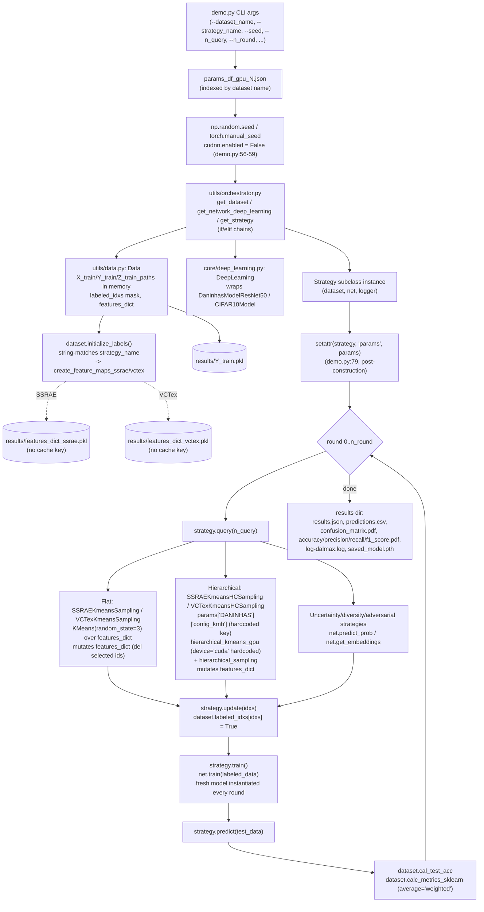

# Architecture — Current State

Status: honest snapshot of the code as of 2026-08-23 (commit `554a205` and earlier). This
document describes what the code **does today**, including its rough edges. See
`target-architecture.md` for where it should go and `refactor-plan.md` for how to get there.

## 1. Module map

| Area | File(s) | Responsibility today |
|---|---|---|
| CLI + orchestration entry point | `demo.py` | argparse, params loading, results-dir naming, seeding, the whole AL round loop, metrics, plotting, persistence — all in one ~289-line `main()` |
| Secondary/dead entry point | `demo_ssl.py` | prints "Hello from SSL demo_ssl.py" and imports `core/tools/SSL/code_kmh.py`; not wired to any CLI flag, not part of the experimental protocol |
| Registries (if/elif) | `utils/orchestrator.py` | `get_handler`, `get_dataset`, `get_network_deep_learning`, `get_strategy` — four if/elif chains mapping string names to classes |
| Dataset loading + feature caching | `utils/data.py` | `Data` class (in-memory pool + labeled mask), `get_DANINHAS`, `get_CIFAR10`, `get_CIFAR10_Download`; also owns SSRAE/VCTex feature extraction and pickle caching, t-SNE plotting |
| Torch `Dataset` handlers | `utils/dataset.py` | `DANINHAS_Hander`, `CIFAR10_Handler` — image transforms + `(x, y, index)` tuples |
| Training/inference engine | `core/deep_learning.py` | `DeepLearning` wraps a model class; `train`, `predict`, `predict_prob`, `predict_prob_dropout(_split)`, `get_embeddings`, `save_model`, `load_model` (marked `# TODO: FIX THIS`) |
| Classifier architectures | `core/daninhas_model.py` (ResNet50 + unused ViT-B/16 variant), `core/cifar10_model.py` (small CNN) | `forward()` returns `(logits, embedding)` tuple used by both training and embedding-based strategies |
| Strategy base class | `core/query_strategies/strategy.py` | `Strategy` — query/update/train/predict/info/save_model/plot_selected_images |
| Uncertainty strategies | `least_confidence.py`, `margin_sampling.py`, `entropy_sampling.py`, `*_dropout.py`, `bayesian_active_learning_disagreement_dropout.py` | classic AL baselines from the `deepALplus`-style lineage |
| Diversity strategies | `kmeans_sampling.py`, `kcenter_greedy.py` | operate on `net.get_embeddings()` (ResNet penultimate layer), no dataset coupling |
| Adversarial strategies | `adversarial_bim.py`, `adversarial_deepfool.py` | batched GPU-capable perturbation-distance ranking |
| RNHAL representation (flat) | `ssrae_kmeans_sampling.py` (`SSRAEKmeansSampling`), `vctex_kmeans_sampling.py` (`VCTexKmeansSampling`) | flat k-means over `dataset.features_dict`, k = n_query, pick closest-to-centroid sample per cluster |
| RNHAL representation (hierarchical) | `ssl_ssrae_sampling.py` (`SSLStrategy` base, `SSRAEKmeansHCSampling`, `VCTexKmeansHCSampling`) | hierarchical k-means + hierarchical resampling over `dataset.features_dict` |
| SSRAE feature extractor | `core/tools/SSRAE/extractor.py` (`ColorFeatureExtractor`), `core/tools/SSRAE/rnn.py` (`RNN`), `core/tools/SSRAE/splitter.py` (`WindowSplitter`, not read in this pass) | randomized-network spatio-spectral texture representation, output = `hstack[β_R, β_G, β_B, β_S_R, β_S_G, β_S_B]` (6 equal-shape blocks, **row-interleaved by the final reshape, not contiguous** — see `.specs/experiments/ablation-study.md` §6.1 Layout caveat) |
| VCTex feature extractor | `core/tools/VCTex/VCTexMethod.py` (not read in this pass, referenced from `utils/data.py:10,73`) | alternative color-texture representation, `Q=[5,17]` |
| Hierarchical k-means / sampling (vendored from Meta DINOv2 SSL) | `core/tools/SSL/src/hierarchical_kmeans_gpu.py`, `core/tools/SSL/src/hierarchical_sampling.py`, `core/tools/SSL/src/clusters.py`, `core/tools/SSL/src/kmeans_gpu.py` (not read) | GPU k-means with resampling steps, `HierarchicalCluster` bookkeeping, budget-aware recursive sampling |
| Logging | `utils/LOGGER.py` | module-level singleton logger; writes to `results/logs/<timestamp>-log-dalmax.log`, later renamed by `demo.py` into the run's results directory |
| Reporting (post-hoc) | `utils/report/1_cm_extract_from_pdf.py` … `4_report_build_average_results.py`, `build_method_metrics.py`, `plot_results_dir.py` | separate numbered scripts that walk `results/` and aggregate metrics/confusion matrices across seeds |
| Params | `params_df_gpu_0.json`, `params_df_gpu_1.json` (identical schema, different `config_kmh`) | per-dataset hyperparameter dict keyed by dataset name string |
| Dead/experimental files | `temp_teste.py`, `test.py` (not a pytest file — ad-hoc CSV table builder), `TRASH_TEXT.md`, `sampled_data.pdf`, `core/query_strategies/old_functions.py` | not imported by `demo.py` or `utils/orchestrator.py`; safe to remove in Phase 4 |

## 2. Data flow (today)

1. `demo.py` parses CLI args (`--dir_results --params_json --seed --n_init_labeled --n_query --n_round --dataset_name --strategy_name`).
2. Loads the whole params JSON, indexes it by `args.dataset_name` (`demo.py:38-44`).
3. Builds the results directory path from `dir_results + data_dir_basename + SEED_.. + NQ_.._NIL_.._NR_.._NE_.. + strategy_name` (`demo.py:44-54`).
4. Sets global seeds and disables cuDNN (`demo.py:56-59`).
5. `utils.orchestrator.get_dataset(name, params)` → `utils/data.py:get_DANINHAS`/`get_CIFAR10` → walks `train/`/`test/` folders, builds a `Data` object holding all images in memory as `np.ndarray` plus `Y_train`/`Y_test`/paths.
6. `utils.orchestrator.get_network_deep_learning(name, device, params)` → `DeepLearning(ModelClass, params[name], device)`.
7. `utils.orchestrator.get_strategy(name)` → strategy class; instantiated as `strategy = StrategyClass(dataset, net, logger)`.
8. `setattr(strategy, "params", params)` (`demo.py:79`) injects the **full, un-indexed** params dict onto the strategy instance after construction.
9. `dataset.initialize_labels(n_init_labeled, strategy_name)` — random initial labeled pool; **also** triggers SSRAE/VCTex feature-map computation by string-matching `strategy_name` (`utils/data.py:220-229`).
10. Round 0: `strategy.train()` → `net.train(labeled_data)` (fresh model instantiated every call, see §3); `strategy.predict(test_data)`; metrics via `dataset.cal_test_acc` and `dataset.calc_metrics_sklearn` (average='weighted', not macro — see known-issues).
11. For `rd in 1..n_round`: `strategy.query(n_query)` → `strategy.update(idxs)` (flips `dataset.labeled_idxs`) → `strategy.train()` → `strategy.predict()` → metrics appended.
12. After the loop: confusion matrix + accuracy/precision/recall/F1 plots saved as PDFs, log file moved into the results dir, model saved (`strategy.save_model`), `results.json` and `predictions.csv` written.

### Mermaid flowchart



## 3. Where embeddings are computed and cached

- **SSRAE**: `utils/data.py:create_feature_maps_ssrae` (`utils/data.py:117-184`). `Q = 13` hardcoded at `utils/data.py:139`. Cache path hardcoded to `results/features_dict_ssrae.pkl` (`utils/data.py:120,181`), **no key** for dataset name, `Q`, or embedding variant — reusing the file across a different dataset or a different `Q` silently loads stale features (confirmed hazard, see `known-issues.md`).
- **VCTex**: `utils/data.py:create_feature_maps_vctex` (`utils/data.py:46-115`). `Q = [5, 17]` hardcoded at `utils/data.py:70`. Cache path hardcoded to `results/features_dict_vctex.pkl` (`utils/data.py:48,111`), same no-key hazard.
- Both caches are computed **once for the entire unlabeled pool** (all `unlabeled_ids` at `initialize_labels` time, `utils/data.py:130-131`), not per-round, and both are populated into `Data.features_dict`, a plain `dict[int, np.ndarray|torch.Tensor]`.
- `Data.__init__` (`utils/data.py:22-27`) also unconditionally pickles `Y_train` to `results/Y_train.pkl` the first time any `Data` object is constructed — same no-key problem (a CIFAR10 run and a DANINHAS run share the file if it happens to exist first).
- Selection strategies **mutate** `features_dict` as a side effect of `query()`: both flat strategies (`ssrae_kmeans_sampling.py:48-50`, `vctex_kmeans_sampling.py:51-53`) and the hierarchical strategy (`ssl_ssrae_sampling.py:100-102`) `del features_dict[img_id]` for every selected sample. This means `features_dict` size shrinks every round and is implicitly assumed to always be in sync with `dataset.labeled_idxs`; there is no independent invalidation path.

## 4. How hierarchical sampling is configured (`config_kmh`)

- Read from `self.params['DANINHAS']['config_kmh']` in `SSLStrategy.query` (`core/query_strategies/ssl_ssrae_sampling.py:66`) — **the dataset key `'DANINHAS'` is hardcoded**, not `self.params[self.dataset_name]` or similar. Running `SSRAEKmeansHCSampling`/`VCTexKmeansHCSampling` against `CIFAR10` will raise `KeyError` because `params_df_gpu_*.json`'s `"CIFAR10"` block has no `config_kmh` entry (confirmed in `params_df_gpu_0.json:25-42`).
- Shape: `{"n_clusters": List[int], "n_levels": int, "sample_sizes": List[int]}`. Current values (`params_df_gpu_0.json:19-23`): `n_clusters=[600,200,100]`, `n_levels=3`, `sample_sizes=[30,15,2]`.
- Passed straight into `hkmg.hierarchical_kmeans_with_resampling(data=..., n_clusters=N_CLUSTERS, n_levels=N_LEVELS, sample_sizes=SAMPLE_SIZES, verbose=False)` (`ssl_ssrae_sampling.py:84-90`), which asserts `len(n_clusters) == len(sample_sizes) == n_levels`.
- **`data=torch.tensor(data, device="cuda", ...)` is hardcoded to CUDA** (`ssl_ssrae_sampling.py:85`) — the hierarchical strategies cannot run at all on the no-GPU local dev machine; there is no CPU fallback branch anywhere in this path. This is a coupling point not previously called out in the seed known-issues list.
- Result of clustering (`List[dict]` per level with `clusters` arrays) is wrapped into `core/tools/SSL/src/clusters.py:HierarchicalCluster.from_dict`, then `hierarchical_sampling.hierarchical_sampling(cl, target_size=n_query)` walks the hierarchy top-down (`recursive_hierarchical_sampling`) to pick `n_query` total samples respecting per-level budgets.

## 5. Coupling points and hidden dependencies

| # | Coupling point | Location | Why it matters |
|---|---|---|---|
| 1 | `setattr(strategy, "params", params)` instead of constructor injection | `demo.py:79` | Strategy classes silently depend on an attribute that may not exist at `__init__` time; `SSLStrategy.__init__` defends against this with `self.params = self.params if hasattr(self, 'params') else None` (`ssl_ssrae_sampling.py:29`), which only works because `demo.py` happens to call `setattr` before the first `query()`. Any other call order (e.g. unit tests constructing a strategy directly) breaks silently with `self.params is None`. |
| 2 | Hardcoded dataset key `'DANINHAS'` | `core/query_strategies/ssl_ssrae_sampling.py:66` | Breaks `SSRAEKmeansHCSampling`/`VCTexKmeansHCSampling` for any dataset other than DANINHAS, including CIFAR10 which is a documented CLI choice. |
| 3 | `KMeans(random_state=3)` literal | `core/query_strategies/ssrae_kmeans_sampling.py:23`, `core/query_strategies/vctex_kmeans_sampling.py:26` | Ignores the experiment's `--seed`; every run of these two strategies clusters identically regardless of the seed sweep (`SEEDS=(1 2 3)` in `run_pipe_gpu_*.sh`), undermining the seed-based variance analysis. |
| 4 | Pickle caches with no key | `utils/data.py:23,48,120` | See §3 — stale-cache hazard is the single largest blocker to the representation ablation (§6.1) and to running multiple datasets/`Q` values without manual cache deletion. |
| 5 | `features_dict` mutation as selection side effect | `ssrae_kmeans_sampling.py:48-50`, `vctex_kmeans_sampling.py:51-53`, `ssl_ssrae_sampling.py:100-102` | Couples "having selected a sample" to "having deleted it from a shared mutable dict owned by `Data`"; makes it impossible to re-run `query()` idempotently or to inspect the pre-selection embedding pool after the fact. |
| 6 | `torch.backends.cudnn.enabled = False` globally | `demo.py:59` | Disables cuDNN entirely (perf loss on the 10 GB lab GPUs) instead of using seed-preserving deterministic-mode flags (`torch.backends.cudnn.deterministic = True` / `torch.use_deterministic_algorithms`). |
| 7 | `if/elif` registries | `utils/orchestrator.py:14-80` | Every new dataset/model/strategy requires editing 1-4 files by hand (`utils/orchestrator.py`, `core/query_strategies/__init__.py`, `demo.py`'s `choices=[...]`) with no compile-time or import-time check that they stay in sync (there is no test for this today — see `known-issues.md`). |
| 8 | `device="cuda"` hardcoded in hierarchical k-means call | `ssl_ssrae_sampling.py:85` | No CPU fallback; blocks any local smoke test of the hierarchical strategies on the no-GPU dev notebook. |
| 9 | `calc_metrics_sklearn` uses `average='weighted'` | `utils/data.py:281-295` | The ablation study spec (`.specs/experiments/ablation-study.md`) requires **macro F1**; the current metric function does not compute it. Any ablation implementation must add (or switch to) macro averaging. |
| 10 | `DeepLearning.train` re-instantiates the network from scratch every call | `core/deep_learning.py:33` (`self.clf = self.net(n_classes).to(self.device)`) | Each AL round retrains a fresh randomly-initialized network rather than warm-starting from the previous round's weights; this is a deliberate-looking design choice (matches typical DAL benchmarks) but is undocumented and worth confirming with the advisor before Phase 2 changes anything nearby. |
| 11 | `strategy_name` string comparisons drive feature-map creation | `utils/data.py:220-229` | `Data.initialize_labels` knows about specific strategy class names (`"SSRAEKmeansSampling"`, `"SSRAEKmeansHCSampling"`, ...) — a new representation strategy needs a matching `elif` here too, on top of the `utils/orchestrator.py` and `core/query_strategies/__init__.py` registrations. |

## 6. Params JSON schema (as used today)

```json
{
  "<DATASET_NAME>": {
    "data_dir": "DATA/...",
    "n_epoch": 10,
    "n_drop": 10,
    "n_classes": 5,
    "train_args": {"batch_size": 256, "num_workers": 4},
    "test_args": {"batch_size": 256, "num_workers": 4},
    "optimizer_args": {"lr": 0.05, "momentum": 0.3},
    "config_kmh": {"n_clusters": [600, 200, 100], "n_levels": 3, "sample_sizes": [30, 15, 2]}
  }
}
```
`config_kmh` is only present for `DANINHAS` in both `params_df_gpu_0.json` and `params_df_gpu_1.json` — confirmed by direct inspection. There is no schema validation; a missing or malformed key raises a raw `KeyError`/`TypeError` deep inside `query()`.

## 7. Results directory convention (confirmed from `demo.py:44-54`)

```
{dir_results}/{dataset_folder_basename}/SEED_{seed}/NQ_{n_query}_NIL_{n_init_labeled}_NR_{n_round}_NE_{n_epoch}/{strategy_name}/
    results.json
    predictions.csv
    confusion_matrix.pdf
    accuracy.pdf / precision.pdf / recall.pdf / f1_score.pdf
    log-dalmax.log
    saved_model.pth
```
No config snapshot or git commit hash is currently saved into this directory — see `reproducibility.md` (owned by `.specs/research-rules/`) and `refactor-plan.md` Phase 2 acceptance criteria.
