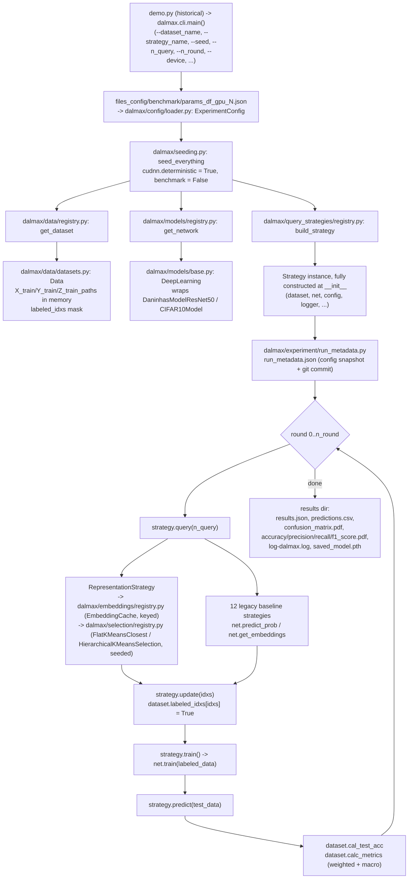

# Architecture — Current State

Status: honest snapshot of the code as of 2026-08-23, **Phase 4 of `refactor-plan.md` complete**
(branch `refactor/phase-4-package`, `git log --oneline b51fb59..HEAD`: `307c7f1`, `38c4b0e`,
`d58e116`, `48a4682`, `79e628c`). `core/` and `utils/` **no longer exist** — confirmed
(`ls core utils` → both "No such file or directory"). All Python source lives in one top-level
package, `dalmax/`. See `target-architecture.md` for the design target (now fully landed, with one
documented layout deviation — module names, §1 below) and `refactor-plan.md` for the phase history.

## History

This document previously (Phase 2, commit `ed37f8a`) described a split codebase: new `dalmax/`
modules wrapping an unmodified `core/`/`utils/` legacy layer, with an explicit "§0 dead code" list
(`utils/orchestrator.py`, three superseded strategy files, two dead `Data` methods) kept in place
per ADR 0002's "wrap, don't delete, until Phase 4" policy. Phase 4 executed that deferred move:
every wrapped legacy file was physically relocated into `dalmax/`, and everything that had already
been superseded and never called by the `dalmax` path was deleted outright rather than carried
forward. See ADR 0002's final amendment for the itemized before/after and
`.specs/quality/known-issues.md` for which known issues that deletion closed.

## 1. Module map (`dalmax/`)

| Area | File(s) | Responsibility |
|---|---|---|
| CLI entry point | `trainer.py` (thin shim, `from dalmax.cli import main`; renamed from the historical `demo.py` on 2026-08-23, see ADR 0006) → `dalmax/cli.py` | Argparse (same flags as the original `demo.py`, plus `--device`/`--embedding_variant`), builds an `ExperimentConfig` via `dalmax/config/loader.py`, delegates to `dalmax/experiment/runner.py::ExperimentRunner` + `dalmax/experiment/reporter.py::write_report`. `trainer.py` and `scripts/benchmark/run_pipe_gpu_*.sh` keep working unchanged. |
| Config layer | `dalmax/config/schema.py` (`ExperimentConfig`, `DatasetConfig`, `ConfigError`), `dalmax/config/loader.py` (`load_experiment_config`) | Reads the on-disk params JSON schema (backward compatible, see §6), raises `ConfigError` (a `ValueError` subclass) naming the missing/invalid key instead of a bare `KeyError`. |
| Seeding | `dalmax/seeding.py` | `seed_everything`, `derive_seed(seed, purpose)` — single source of RNG seeding, including `torch.backends.cudnn.deterministic = True` / `benchmark = False`. |
| Logging | `dalmax/logging_utils.py` (moved from `utils/LOGGER.py`) | Module-level singleton logger; writes to `results/logs/<timestamp>-log-dalmax.log`, later renamed by the run into the run's results directory. |
| Dataset loading | `dalmax/data/datasets.py` (`Data`, moved/superseding `utils/data.py`), `dalmax/data/handlers.py` (torch `Dataset` wrappers, was `utils/dataset.py`), `dalmax/data/loaders.py` (`get_DANINHAS`/`get_CIFAR10`/`get_CIFAR10_Download`), `dalmax/data/registry.py` (`DATASET_REGISTRY`/`get_dataset`) | In-memory pool + labeled mask, `calc_metrics` (weighted + macro precision/recall/F1). `utils/data.py` (683 lines, including the legacy SSRAE/VCTex feature-map methods and the unkeyed pickle caches) was **not** carried forward as-is — its live logic had already been fully superseded by `dalmax/embeddings/` in Phase 2/3, so it was deleted rather than moved. |
| Model architectures | `dalmax/models/base.py` (`DeepLearning`, was `core/deep_learning.py`), `dalmax/models/daninhas_resnet50.py` (was `core/daninhas_model.py`; the unused `DaninhasModelVitB16` class was dropped, not carried over — KI-25, resolved by deletion), `dalmax/models/cifar10_cnn.py` (was `core/cifar10_model.py`), `dalmax/models/registry.py` (`MODEL_REGISTRY`/`get_network`/`get_model_class`), `dalmax/models/checkpoint.py` (`save_checkpoint`/`load_checkpoint`/`describe_checkpoint`, new 2026-08-23) | `forward()` returns `(logits, embedding)`; `DeepLearning.train/predict/predict_prob/predict_prob_dropout(_split)/get_embeddings/save_model/load_model`. **Resolved (2026-08-23)**: `save_model`/`load_model` used to save/load the model *class* (`self.net`) instead of the trained instance (`self.clf`) — see `known-issues.md` KI-22 — now go through `dalmax/models/checkpoint.py`'s `dalmax-checkpoint` format (state_dict + model_name/n_classes/class_names/img_size/extra metadata), consumed by the new `dalmax/inference/` tools (`predict.py`, `loader.py`, `gui.py`, `trainer.py`). |
| Inference tools | `dalmax/inference/predictor.py` (`Predictor`), `dalmax/inference/export.py` (`write_predictions_csv`), `dalmax/inference/gui.py` (`main`) — repo-root shims `predict.py`, `loader.py`, `gui.py`. New 2026-08-23 (ADR 0006), alongside the checkpoint-format fix above | `Predictor(checkpoint_path, device).predict_paths(paths)` runs a trained checkpoint on arbitrary image files outside the active-learning loop; preprocessing (resize to the checkpoint's `img_size`, then the live dataset handler's own `.transform`, via `dalmax.data.registry.get_handler`) is read from the same code training used, never re-derived. `predict.py` (CLI, `--image`/`--dir`, writes `predictions.csv` + per-image `*.pred.json`), `loader.py` (checkpoint inspection: metadata, param counts, CPU dummy-forward sanity check), `gui.py` (tkinter mini-app; all `tkinter` construction inside `main()`, so importing the module is side-effect-free/headless-CI-safe, see `tests/test_gui_helpers.py`). |
| Strategy base class | `dalmax/query_strategies/base.py` (`Strategy`, was `core/query_strategies/strategy.py`) | query/update/train/predict/info/save_model/plot_selected_images. |
| 12 baseline strategies | `dalmax/query_strategies/{random_sampling,least_confidence,least_confidence_dropout,margin_sampling,margin_sampling_dropout,entropy_sampling,entropy_sampling_dropout,bayesian_active_learning_disagreement_dropout,kcenter_greedy,kmeans_sampling,adversarial_bim,adversarial_deepfool}.py` | Moved unchanged from `core/query_strategies/`, module names kept 1:1 (no family-grouping into `uncertainty.py`/`diversity.py`/`bayesian.py`/`adversarial.py` — see `target-architecture.md` for why that original sketch was not adopted). |
| Representation strategy (generic) | `dalmax/query_strategies/representation.py` (`RepresentationStrategy`) | The single class backing the four legacy `*Kmeans*Sampling`/`SSLStrategy` CLI names (as fixed-behavior presets) plus the new generic `RepresentationStrategy` CLI choice used by the ablation studies. Holds its own `{id: embedding}` map, recomputed non-destructively from `dataset.labeled_idxs` each `query()` call — never mutates `dataset.features_dict`. |
| Strategy registry | `dalmax/query_strategies/registry.py` (`STRATEGY_REGISTRY`, `LEGACY_STRATEGY_REGISTRY`, `REPRESENTATION_PRESETS`, `build_strategy`) | Replaces the deleted `utils/orchestrator.py::get_strategy`'s if/elif chain. Every `SelectionStrategy` gets its RNG seed from `dalmax.seeding.derive_seed(config.seed, "selection")`, never a hardcoded literal. |
| Embedding providers + cache | `dalmax/embeddings/{base,ssrae_provider,vctex_provider,resnet_imagenet_provider,cache,variants,registry}.py` | `EmbeddingCache` keys every cache file on `(dataset, extractor, Q, variant, split, pool_hash)` — see §3. |
| Selection strategies | `dalmax/selection/{base,flat_kmeans_closest,flat_kmeans_proportional,hierarchical_kmeans,registry}.py` | `FlatKMeansClosest` (was the `ssrae_kmeans_sampling.py`/`vctex_kmeans_sampling.py` logic, now seeded); `HierarchicalKMeansSelection` (was `ssl_ssrae_sampling.py`'s `SSLStrategy`, now takes `hierarchy`/`device` via constructor injection — see §4). |
| Vendored tools | `dalmax/tools/SSRAE/{extractor,rnn,splitter,classifier,classification}.py`, `dalmax/tools/VCTex/{VCTexMethod,extractor,rnn,split,classification}.py`, `dalmax/tools/SSL/src/{hierarchical_kmeans_gpu,hierarchical_sampling,clusters,kmeans_gpu,utils,dist_comm,distributed_kmeans_gpu}.py` | Moved unchanged (contents untouched) from `core/tools/`; `SSL/` remains Meta-licensed, wrap-don't-edit still applies to file *contents*. |
| Experiment orchestration | `dalmax/experiment/{runner,reporter,run_metadata}.py` | `ExperimentRunner.run()` drives the round loop; `reporter.write_report` writes `results.json`/`predictions.csv`/plots; `run_metadata.write_run_metadata` writes `run_metadata.json` (see §8). |
| Reporting (post-hoc) | `dalmax/reporting/{extract_confusion_matrices,chunk_results,average_confusion_matrices,average_results,build_method_metrics,plot_results_dir,ablation_report}.py` | Renamed/renumbered from `utils/report/1_..4_*.py` into descriptive names; `ablation_report.py` is new (Phase 3). |
| Params | `files_config/benchmark/params_df_gpu_0.json`, `files_config/benchmark/params_df_gpu_1.json` | Per-dataset hyperparameter dict keyed by dataset name string; schema in §6. |

Deleted outright in Phase 4 (not moved, not kept as dead code): `utils/orchestrator.py`,
`core/query_strategies/{ssrae_kmeans_sampling,vctex_kmeans_sampling,ssl_ssrae_sampling}.py`,
`core/query_strategies/old_functions.py`, `utils/data.py`'s `create_feature_maps_ssrae`/
`create_feature_maps_vctex`/`plot_features_tsne_*`, `demo_ssl.py`, `code_kmh.py`, `temp_teste.py`,
`test.py` (root), `TRASH_TEXT.md`, `sampled_data.pdf`, `TODO.md`, and local orphaned
`results/*.pkl` scratch files. `DaninhasModelVitB16` was dropped when `core/daninhas_model.py`
became `dalmax/models/daninhas_resnet50.py`.

## 2. Data flow (today)

1. `demo.py` (historical) → `dalmax.cli.main()` parses CLI args (`--dir_results --params_json --seed --n_init_labeled --n_query --n_round --dataset_name --strategy_name`, plus `--device`/`--embedding_variant`).
2. `dalmax/config/loader.py::load_experiment_config` reads the params JSON, validates/normalizes it into a typed `ExperimentConfig`/`DatasetConfig`, raising `ConfigError` (not a bare `KeyError`) on anything missing or malformed.
3. `dalmax/seeding.py::seed_everything(config.seed)` sets `np.random`/`torch` seeds and `torch.backends.cudnn.deterministic = True` / `benchmark = False` (not the old `cudnn.enabled = False`).
4. `dalmax/data/registry.py::get_dataset(name, config)` → `dalmax/data/loaders.py::get_DANINHAS`/`get_CIFAR10` → builds a `dalmax.data.datasets.Data` object holding all images in memory plus `Y_train`/`Y_test`/paths.
5. `dalmax/models/registry.py::get_network(name, device, config)` → `DeepLearning(ModelClass, legacy_params_dict, device)`.
6. `dalmax/query_strategies/registry.py::build_strategy(name, dataset, net, config, logger)` constructs the strategy fully at `__init__` time — no post-construction `setattr(strategy, "params", ...)` anywhere in `dalmax`.
7. `dataset.initialize_labels(n_init_labeled)` draws the random initial labeled pool; embedding computation (if any) is owned by `RepresentationStrategy`/`EmbeddingCache`, not by string-matching `strategy_name` inside `Data`.
8. Round 0 and each subsequent round: `strategy.train()` → `strategy.query(n_query)` (rounds ≥ 1) → `strategy.update(idxs)` → `strategy.train()` → `strategy.predict(test_data)` → metrics via `dataset.cal_test_acc` and `dataset.calc_metrics` (both weighted and macro precision/recall/F1).
9. `dalmax/experiment/run_metadata.py::write_run_metadata` writes `run_metadata.json` before the round loop starts (see §8).
10. After the loop: `dalmax/experiment/reporter.py::write_report` saves confusion-matrix + accuracy/precision/recall/F1 plots as PDFs, moves the log file into the results dir, saves the model, and writes `results.json`/`predictions.csv`.

### Mermaid flowchart



## 3. Where embeddings are computed and cached

`dalmax/embeddings/cache.py::EmbeddingCache` keys every cache file on
`(dataset, extractor, Q, variant, split, pool_hash)` — filename
`{dataset}__{extractor}__Q{q}__{variant}__{split}__pool{pool_hash}.pkl` under
`results/cache/embeddings/`. Only the `"full"` variant is ever cached; `spatial`/`spectral` are
sliced on load (`dalmax/embeddings/variants.py`), so those two variants never collide with `full` or
with each other. `Q` comes from `EmbeddingConfig.q`, defaulted per-extractor by
`dalmax/config/loader.py` (SSRAE default `13`, VCTex default `[5, 17]`) — never a hardcoded literal
for any run through `dalmax.cli`.

The original unkeyed pickle caches this replaced (`results/features_dict_ssrae.pkl`,
`results/features_dict_vctex.pkl`, `results/Y_train.pkl`, and the Phase 1 keyed-but-limited
`utils/data.py::cache_file_path` path) are gone along with `utils/data.py` itself (§1). Any such
files still on disk from before Phase 4 are orphaned scratch, not read by anything in `dalmax/` —
see `.claude/rules/data-safety.md` before deleting them (never delete `results/` content
automatically; that's a lab-machine housekeeping task, see `known-issues.md`).

Selection strategies do **not** mutate a shared `features_dict`: `RepresentationStrategy` holds its
own `{id: embedding}` map and recomputes the current unlabeled subset from `dataset.labeled_idxs`
on every `query()` call, non-destructively.

## 4. How hierarchical sampling is configured (`config_kmh`)

`dalmax/selection/hierarchical_kmeans.py::HierarchicalKMeansSelection` takes `hierarchy` via
constructor injection (a duck-typed `HierarchyConfig`), resolved by
`dalmax/query_strategies/registry.py::build_strategy` from `config.dataset.selection.hierarchy` —
never a hardcoded dataset-name string lookup. A legacy `"config_kmh"` block with no `"selection"`
key in the params JSON is read as `selection = {"method": "hierarchical", "hierarchy": config_kmh}`
(full backward compatibility with the existing shape `{"n_clusters": List[int], "n_levels": int,
"sample_sizes": List[int]}`, e.g. `files_config/benchmark/params_df_gpu_0.json`'s `n_clusters=[600,200,100]`,
`n_levels=3`, `sample_sizes=[30,15,2]`). Running a hierarchical strategy against a dataset whose
params JSON entry has no `config_kmh`/`selection.hierarchy` block raises a `ConfigError` naming the
missing key (not a `KeyError`) — this is currently true for `CIFAR10` (KI-23, still open: a content
gap in the params files, not a code gap).

`device` comes from `ExperimentConfig.device` (`--device {auto,cuda,cpu}`, `auto` resolving to
`cuda` iff available) — not a hardcoded `"cuda"`. CPU support is exercised by
`tests/test_selection_hierarchical.py`. The clustering call itself goes to the vendored
`dalmax/tools/SSL/src/hierarchical_kmeans_gpu.py::hierarchical_kmeans_with_resampling`, and the
result is wrapped into `dalmax/tools/SSL/src/clusters.py::HierarchicalCluster.from_dict` then walked
by `dalmax/tools/SSL/src/hierarchical_sampling.py::hierarchical_sampling`.

## 5. Historical coupling points (fixed in Phase 2, files since deleted in Phase 4)

The pre-refactor `demo.py` (historical)/`utils/orchestrator.py`/`utils/data.py` design had several confirmed
defects — post-construction `setattr(strategy, "params", ...)` instead of constructor injection,
a hardcoded `self.params['DANINHAS']` key, `KMeans(random_state=3)` ignoring `--seed`, unkeyed
pickle caches, `features_dict` mutated as a query() side effect, `torch.backends.cudnn.enabled =
False` globally, `if/elif` registries, `device="cuda"` hardcoded, `average='weighted'`-only
metrics, and a `strategy_name`-string-matching branch in `Data.initialize_labels`. All of these were
fixed on the `dalmax` path in Phase 2/3 (the fixes are described in context above — §2-§4 — and in
`.specs/quality/known-issues.md`, which is the authoritative status table); the legacy files that
originally exhibited them (`utils/orchestrator.py`, `utils/data.py`,
`core/query_strategies/{ssrae_kmeans_sampling,vctex_kmeans_sampling,ssl_ssrae_sampling}.py`) no
longer exist on disk as of Phase 4 — see ADR 0002's final amendment. One item remains genuinely
**unresolved**, not merely superseded: `DeepLearning.train` re-instantiates the network from
scratch every call (`dalmax/models/base.py`) rather than warm-starting from the previous round's
weights — a deliberate-looking design choice, undocumented, worth confirming with the advisor; not
tracked as a numbered known issue.

## 6. Params JSON schema (as used today)

```json
{
  "<DATASET_NAME>": {
    "data_dir": "DATA/...",
    "n_epoch": 10,
    "n_drop": 10,
    "n_classes": 5,
    "train_args": {"batch_size": 256, "num_workers": 4},
    "test_args": {"batch_size": 256, "num_workers": 4},
    "optimizer_args": {"lr": 0.05, "momentum": 0.3},
    "config_kmh": {"n_clusters": [600, 200, 100], "n_levels": 3, "sample_sizes": [30, 15, 2]}
  }
}
```
`config_kmh` is only present for `DANINHAS` in both `files_config/benchmark/params_df_gpu_0.json` and
`files_config/benchmark/params_df_gpu_1.json`. `dalmax/config/loader.py::load_experiment_config` reads this exact on-disk
schema (no breaking change) and additionally accepts two optional per-dataset keys:
`"embedding": {"extractor": "ssrae"|"vctex"|"resnet_imagenet", "q": ..., "variant":
"full"|"spatial"|"spectral"}` and `"selection": {"method":
"flat_closest"|"flat_proportional"|"hierarchical", "hierarchy": {...}}`. Every raised error is a
`dalmax.config.schema.ConfigError` naming the missing/invalid key. See
`.specs/experiments/experimental-protocol.md` and `.specs/experiments/ablation-study.md` for the
exact new-key syntax used by the ablations.

## 7. Results directory convention

```
{dir_results}/{dataset_folder_basename}/SEED_{seed}/NQ_{n_query}_NIL_{n_init_labeled}_NR_{n_round}_NE_{n_epoch}/{strategy_name}/
    results.json          # + all_precision_macro/all_recall_macro/all_f1_macro
    predictions.csv
    confusion_matrix.pdf
    accuracy.pdf / precision.pdf / recall.pdf / f1_score.pdf
    log-dalmax.log
    saved_model.pth
    run_metadata.json     # config snapshot + git commit hash, see §8 below
```
The naming convention and file set are byte-for-byte unchanged from the pre-refactor layout
(`dalmax/experiment/runner.py::results_dir_for`, `dalmax/experiment/reporter.py`).

## 8. Run metadata

`dalmax/experiment/run_metadata.py::write_run_metadata` writes `run_metadata.json` into every
results directory (via `ExperimentRunner.run`, before the round loop starts) containing: the
fully-resolved `ExperimentConfig` as a JSON-serializable dict (`to_dict`), `git_commit`
(best-effort `git rev-parse HEAD`, `None` if unavailable), `python_version`, `torch_version`,
`cuda_available`, `started_at` (UTC ISO-8601), and `environment` (from `dalmax/experiment/environment.py::collect_environment`: `os`, `machine`, `python`, `torch`, `gpus[]`, `cuda_visible_devices`, `current_device`, `runtime`; best-effort, null on probe failure, no hostname). See `research-rules/reproducibility.md`.
