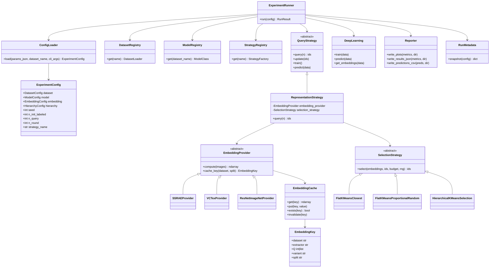

# Architecture — Target State

Status: design target for the refactor described in `refactor-plan.md` (Phases 2-4). **Phase 4
landed 2026-08-23 (branch `refactor/phase-4-package`) — the package consolidation described here is
now complete**; `core/` and `utils/` no longer exist. The tree in §2 is, with the deviations
itemized below, what is actually on disk today; every "was `core/...`/`utils/...`" comment in it
is now a historical pointer to a deleted file, not a currently-wrapped one. See `current-state.md`
for the live module map and ADR 0002's final amendment for the executed move/delete list.

## What landed vs. residual deltas (updated 2026-08-23, Phase 4 complete)

Phase 2 created the `dalmax/` package immediately (ADR 0002 amendment) and moved in the modules that
needed genuinely new abstractions; Phase 4 then physically moved everything else out of `core/`/
`utils/` into `dalmax/` and deleted what had already been superseded. Every row below is now "Yes",
with three documented layout deviations from this file's original sketch (kept as chosen-final,
not fixed later):

| §2 path | Landed? | Actual location / deviation |
|---|---|---|
| `cli.py` | Yes | `dalmax/cli.py` |
| `config/schema.py`, `config/loader.py` | Yes | as shown |
| `seeding.py` | Yes | as shown |
| `data/registry.py`, `datasets.py`, `handlers.py`, `loaders.py` | Yes | `dalmax/data/{registry,datasets,handlers,loaders}.py` — `datasets.py`'s class is still named `Data` (not renamed to `PoolDataset` as this file originally sketched; **deviation, kept as chosen-final** — no code or test currently references the name `PoolDataset`) |
| `embeddings/{base,ssrae_provider,vctex_provider,resnet_imagenet_provider,variants,cache,registry}.py` | Yes | as shown |
| `selection/{base,flat_kmeans_closest,flat_kmeans_proportional,hierarchical_kmeans,registry}.py` | Yes | as shown (filenames match exactly) |
| `query_strategies/representation.py`, `query_strategies/registry.py` | Yes | as shown |
| `query_strategies/base.py`, `uncertainty.py`, `diversity.py`, `bayesian.py`, `adversarial.py` | **Deviation, kept as chosen-final** | the 12 legacy strategy classes moved unchanged into `dalmax/query_strategies/*.py` **keeping their original 1:1 module names** (`random_sampling.py`, `least_confidence.py`, `least_confidence_dropout.py`, `margin_sampling.py`, `margin_sampling_dropout.py`, `entropy_sampling.py`, `entropy_sampling_dropout.py`, `bayesian_active_learning_disagreement_dropout.py`, `kcenter_greedy.py`, `kmeans_sampling.py`, `adversarial_bim.py`, `adversarial_deepfool.py`) rather than being regrouped into the four family files sketched here (`uncertainty.py`/`diversity.py`/`bayesian.py`/`adversarial.py`). `strategy.py` did get renamed to `base.py` as sketched. This grouping-by-family idea was **not adopted** — the 1:1 layout is the documented final choice, not a residual gap |
| `models/base.py`, `daninhas_resnet50.py`, `cifar10_cnn.py`, `models/registry.py` | Yes | `dalmax/models/base.py` (was `core/deep_learning.py`), `daninhas_resnet50.py` (was `core/daninhas_model.py`, `DaninhasModelVitB16` dropped, not moved — KI-25), `cifar10_cnn.py` (was `core/cifar10_model.py`), `registry.py` as shown |
| `experiment/{runner,reporter,run_metadata}.py` | Yes | as shown |
| `reporting/` (cross-run aggregation) | **Deviation, kept as chosen-final** | `dalmax/reporting/{extract_confusion_matrices,chunk_results,average_confusion_matrices,average_results,build_method_metrics,plot_results_dir,ablation_report}.py` — descriptive names as sketched, but this file's tree only listed the first four; `build_method_metrics.py` and `plot_results_dir.py` (both pre-existing at the repo root, moved in) and `ablation_report.py` (new, Phase 3) are additional real modules not in the original sketch |
| `tools/{ssrae,vctex,ssl}/` | Yes (capitalization deviation) | `dalmax/tools/{SSRAE,VCTex,SSL}/` — kept the original mixed-case directory names from `core/tools/` rather than the lowercase `ssrae/vctex/ssl` sketched here; contents otherwise unchanged, `SSL/` still Meta-licensed |

`dalmax/embeddings/cache.py`'s cache key has a `pool_hash` component beyond `(dataset, extractor, Q,
variant, split)` (§4 below reflects this — landed in Phase 2, not a Phase 4 change).
`dalmax/query_strategies/registry.py::REPRESENTATION_PRESETS` (the 4 legacy CLI name →
`(extractor, selection_method)` mapping, with pinned legacy `Q` values) is the mechanism that makes
old `--strategy_name` values keep working, not explicitly sketched in §2's original tree.

See `current-state.md` for the live module map and `refactor-plan.md` Phase 4 for the executed
move/delete list.

## 1. Goals (traced to `.specs/history/prompt-master.md` §4.3 / `.claude/rules/code-quality.md`)

- Single responsibility per module; no duplicated strategy boilerplate.
- Registry pattern over `if/elif` chains, for datasets, models, and strategies.
- Explicit dependency injection — no `setattr` magic (fixes coupling point #1 in `current-state.md`).
- A typed config layer that validates the params JSON instead of raw dict indexing, with no
  hardcoded dataset keys (fixes coupling point #2).
- An `EmbeddingProvider` abstraction with an explicitly-keyed cache (fixes coupling points #3, #4).
- A `SelectionStrategy` abstraction that separates "how points are clustered" from "which strategy
  class you subclass" (fixes coupling point #5, and is the direct enabler for ablations §6.2/§6.3
  in `ablation-study.md`).
- All randomness derived from the experiment seed; no literal `random_state=3` (fixes #3, #6).
- Run metadata (config snapshot + git commit hash) saved into every results directory.

## 2. Target package layout

```
dalmax/
├── cli.py                        # thin CLI: argparse -> ExperimentConfig -> ExperimentRunner.run()
├── config/
│   ├── schema.py                 # dataclasses/pydantic: ExperimentConfig, DatasetConfig,
│   │                              #   ModelConfig, HierarchyConfig, EmbeddingConfig
│   └── loader.py                 # load_config(params_json, dataset_name, cli_args) -> ExperimentConfig
│                                  #   validates presence of keys instead of raising KeyError deep in query()
├── seeding.py                    # seed_everything(seed): np, torch, python random, deterministic cudnn flags
├── data/
│   ├── datasets.py                # Data (was utils/data.py: Data — kept name, not renamed to
│   │                              #   PoolDataset as originally sketched here; see landed-vs-residual table)
│   ├── handlers.py                # torch Dataset wrappers (was utils/dataset.py)
│   ├── loaders.py                 # get_DANINHAS(), get_CIFAR10(), get_CIFAR10_Download()
│   │                              #   (was utils/data.py: get_DANINHAS/get_CIFAR10/get_CIFAR10_Download)
│   └── registry.py                # DATASET_REGISTRY: name -> (loader, handler)
├── embeddings/
│   ├── base.py                    # EmbeddingProvider(ABC): compute(images) -> np.ndarray; cache_key()
│   ├── ssrae_provider.py           # wraps dalmax/tools/SSRAE/{extractor,rnn,splitter}.py, Q from config
│   ├── vctex_provider.py           # wraps dalmax/tools/VCTex/VCTexMethod.py, Q from config
│   ├── resnet_imagenet_provider.py # NEW (ablation 6.3): penultimate-layer features from the
│   │                              #   ImageNet-pretrained ResNet50 already used in daninhas_resnet50.py
│   ├── variants.py                 # slice_embedding(vector, variant, Q): "full"|"spatial"|"spectral"
│   │                              #   full = vector; layout is ROW-INTERLEAVED (verified 2026-08-23,
│   │                              #   see §5) — spatial/spectral are column-group slices of
│   │                              #   vector.reshape(9, 6*(Q+1)), NOT vector[:len//2]/vector[len//2:]
│   └── cache.py                    # EmbeddingCache keyed by (dataset, extractor, Q, variant, split)
│                                  #   path template: results/.cache/embeddings/{dataset}__{extractor}__Q{Q}__{variant}__{split}.pkl
│                                  #   explicit invalidation: cache.invalidate(key) / cache.exists(key)
├── selection/
│   ├── base.py                     # SelectionStrategy(ABC): select(embeddings, ids, budget, rng) -> ids
│   ├── flat_kmeans_closest.py       # today's SSRAEKmeansSampling/VCTexKmeansSampling logic:
│   │                              #   k = budget, pick closest-to-centroid sample per cluster, seeded via rng
│   ├── flat_kmeans_proportional.py  # NEW (ablation 6.3 "without hierarchical module"):
│   │                              #   k = budget, pick RANDOM samples per cluster, proportional to
│   │                              #   cluster size relative to the budget — explicitly distinct from
│   │                              #   flat_kmeans_closest.py (see ablation-study.md §6.3 note)
│   ├── hierarchical_kmeans.py       # wraps dalmax/tools/SSL/src/{hierarchical_kmeans_gpu,hierarchical_sampling,
│   │                              #   clusters}.py; device resolved from ExperimentConfig.device, no hardcoded
│   │                              #   "cuda"; n_clusters/n_levels/sample_sizes entirely from HierarchyConfig
│   └── registry.py                  # SELECTION_REGISTRY: name -> SelectionStrategy class
├── query_strategies/
│   ├── base.py                      # Strategy(ABC) (was core/query_strategies/strategy.py), constructor
│   │                              #   takes (dataset, net, config, logger) — no post-hoc setattr
│   ├── random_sampling.py            # 12 legacy baseline classes, moved 1:1 from core/query_strategies/*.py
│   ├── least_confidence.py            # (module names KEPT, not regrouped into uncertainty.py/diversity.py/
│   ├── least_confidence_dropout.py     #  bayesian.py/adversarial.py as this file originally sketched —
│   ├── margin_sampling.py               #  see the landed-vs-residual table above for why)
│   ├── margin_sampling_dropout.py
│   ├── entropy_sampling.py
│   ├── entropy_sampling_dropout.py
│   ├── bayesian_active_learning_disagreement_dropout.py
│   ├── kcenter_greedy.py
│   ├── kmeans_sampling.py
│   ├── adversarial_bim.py
│   ├── adversarial_deepfool.py
│   ├── representation.py                 # ONE generic RepresentationStrategy(embedding_provider, selection_strategy)
│   │                              #   replaces (deleted) SSRAEKmeansSampling, VCTexKmeansSampling,
│   │                              #   SSRAEKmeansHCSampling, VCTexKmeansHCSampling, and SSLStrategy as 4 fixed
│   │                              #   subclasses; the 4 existing CLI strategy names become config presets
│   │                              #   (embedding=ssrae|vctex, selection=flat_closest|hierarchical) resolved
│   │                              #   through the two registries above
│   └── registry.py                      # STRATEGY_REGISTRY: name -> factory(dataset, net, config, logger)
│                                        #   replaces (deleted) utils/orchestrator.py:get_strategy's if/elif
├── models/
│   ├── base.py                        # DeepLearning (was core/deep_learning.py), takes seeded rng,
│   │                              #   no global cudnn side effect; save_model/load_model now go through
│   │                              #   checkpoint.py (KI-22 fixed 2026-08-23, ADR 0006)
│   ├── daninhas_resnet50.py            # was core/daninhas_model.py, duplicate imports removed,
│   │                              #   unused DaninhasModelVitB16 dropped (not moved)
│   ├── cifar10_cnn.py                   # was core/cifar10_model.py, duplicate imports removed
│   ├── checkpoint.py                     # NEW (2026-08-23): save_checkpoint/load_checkpoint/
│   │                              #   describe_checkpoint -- the dalmax-checkpoint format (state_dict +
│   │                              #   model_name/n_classes/class_names/img_size/extra), CheckpointError
│   │                              #   with a clear message on a legacy pre-fix class-pickle file
│   └── registry.py                       # MODEL_REGISTRY: dataset name -> model class;
│                                        #   get_model_class(name) for checkpoint.py's rebuild step
├── inference/                             # NEW (2026-08-23, ADR 0006): standalone inference over a
│   │                              #   trained dalmax-checkpoint, outside the active-learning loop
│   ├── predictor.py                       # Predictor(checkpoint_path, device): predict_paths(paths) ->
│   │                              #   list[PredictionRow]; preprocessing replicates training exactly
│   │                              #   (resize to img_size, then the live dataset handler's .transform)
│   ├── export.py                          # write_predictions_csv(rows, class_names, path) -- shared by
│   │                              #   predict.py and gui.py so their CSV schema never drifts apart
│   └── gui.py                             # tkinter mini-app, main() only (import stays side-effect-free)
├── experiment/
│   ├── runner.py                        # ExperimentRunner.run(config) — the round loop extracted from demo.py (historical) main()
│   ├── reporter.py                       # per-run reporting: confusion matrix, accuracy/precision/recall/F1 plots,
│   │                              #   results.json, predictions.csv (was demo.py tail half)
│   └── run_metadata.py                    # snapshot(config) -> {config_dict, git_commit_hash, timestamp}
│                                        #   written as run_metadata.json into every results dir
├── reporting/                             # cross-run aggregation (was utils/report/*.py, renumbered to
│   ├── extract_confusion_matrices.py       #   descriptive names; CLI behavior preserved)
│   ├── chunk_results.py
│   ├── average_confusion_matrices.py
│   ├── average_results.py
│   ├── build_method_metrics.py             # (moved in from repo root; not in the original sketch)
│   ├── plot_results_dir.py                  # (moved in from repo root; not in the original sketch)
│   └── campaign_report.py / leaf_check.py    # campaign tables + run-directory completeness check (ablation_report.py removed, ADR 0010)
└── tools/                                 # vendored/adapted third-party code, contents unchanged since Phase 2-3
    ├── SSRAE/                              # was core/tools/SSRAE/ — mixed-case dir name kept, not lowercased
    ├── VCTex/                               # was core/tools/VCTex/ — mixed-case dir name kept, not lowercased
    └── SSL/                                  # was core/tools/SSL/ (hierarchical_kmeans_gpu, hierarchical_sampling,
                                              #   clusters, kmeans_gpu — Meta-licensed code kept as-is per its LICENSE)
```

`tests/` mirrors this package layout 1:1 (see `.specs/quality/testing-strategy.md`).

## 3. Component / class diagram



## 4. Embedding cache contract

**Implemented shape (2026-08-23) differs slightly from the sketch below in two ways**: the cache
root is `results/cache/embeddings/` (no leading dot — `dalmax/embeddings/cache.py::DEFAULT_CACHE_ROOT`),
and the key carries one extra component, `pool_hash` (a 12-hex-char sha256 digest of the sorted
unlabeled-pool ids), because the pool actually embedded depends on `--seed`/`--n_init_labeled`, not
only on `(dataset, extractor, Q, variant, split)` — two runs with the same first five components but
a different seed would otherwise silently share a cache file for a *different* pool. Filename
actually written: `{dataset}__{extractor}__Q{q}__{variant}__{split}__pool{pool_hash}.pkl`. The rest
of this section's contract (key components below, "full" always cached, variants sliced not
recomputed) is otherwise accurate as implemented (`dalmax/embeddings/cache.py`,
`dalmax/embeddings/base.py::EmbeddingKey`).

Cache key is the tuple `(dataset, extractor, Q, variant, split)` plus `pool_hash` (see above):

- `dataset`: e.g. `"daninhas_full"`, `"cifar10"` — never a strategy name.
- `extractor`: `"ssrae" | "vctex" | "resnet_imagenet"`.
- `Q`: extractor hyperparameter (`13` for SSRAE, `[5,17]` for VCTex, `None`/embedding-dim for
  ResNet-ImageNet) — serialized into the key so changing `Q` cannot silently reuse a stale cache.
- `variant`: `"full" | "spatial" | "spectral"` (§5 below). Only meaningful for SSRAE today; VCTex
  and ResNet-ImageNet providers always use `"full"`.
- `split`: `"train"` (only the pool is embedded today; kept explicit for future test-time use).

The **full** embedding is always computed and cached once; `spatial`/`spectral` variants are
**slices of the cached full vector**, never recomputed — this directly satisfies the "never
recompute SSRAE three times" requirement in `ablation-study.md` §6.1. `EmbeddingCache` stores one
file per key, e.g.
`results/cache/embeddings/daninhas_full__ssrae__Q13__full__train__pool<12-hex>.pkl` (see the
implemented-shape note above), replacing the two fixed paths `results/features_dict_ssrae.pkl` /
`results/features_dict_vctex.pkl` (both now orphaned, not migrated — see `known-issues.md` KI-3).

## 5. `embedding_variant` slicing (ablation 6.1 enabler)

**Layout caveat (verified 2026-08-23)**: the SSRAE embedding `emb =
hstack[β_R, β_G, β_B, β_S_RG, β_S_GB, β_S_BR]` (`dalmax/tools/SSRAE/extractor.py`, was
`core/tools/SSRAE/extractor.py:99`) is
**row-interleaved, not six contiguous blocks**. Each `beta` block has shape `(9, Q+1)`;
`torch.hstack` concatenates along columns (axis=1) into a `(9, 6*(Q+1))` matrix, and the
subsequent row-major `.reshape((1, -1))` interleaves all six blocks per row. So
`vector[:len(vector)//2]` is **not** spatial-only and `vector[len(vector)//2:]` is
**not** spectral-only — the correct slice operates on column-groups of the reshaped
`(9, 6*(Q+1))` matrix, which requires knowing `Q`:

```python
def slice_embedding(vector: np.ndarray, variant: str, Q: int) -> np.ndarray:
    matrix = vector.reshape(9, 6 * (Q + 1))   # rows = patch dims, column groups = [R,G,B,RG,GB,BR]
    if variant == "full":
        return vector
    if variant == "spatial":     # R, G, B column-groups (columns [0, 3*(Q+1)))
        return matrix[:, : 3 * (Q + 1)].reshape(-1)
    if variant == "spectral":    # S_RG, S_GB, S_BR column-groups (columns [3*(Q+1), 6*(Q+1)))
        return matrix[:, 3 * (Q + 1) :].reshape(-1)
    raise ValueError(f"unknown embedding_variant: {variant}")
```
This function lives in `dalmax/embeddings/variants.py` and is applied by `RepresentationStrategy`
right before handing embeddings to the `SelectionStrategy` — the cache always stores `full`. `Q`
must be threaded through from `EmbeddingConfig`/`EmbeddingKey` since it is required to recover the
column-group boundaries. **Requirement**: prefer having `SSRAEProvider` return an embedding object
that already exposes block-contiguous accessors (or explicit column-group index ranges) rather than
relying on every call site to know `Q` and re-derive the reshape — see
`.specs/quality/known-issues.md` for the tracked issue and `tests/test_ssrae_embedding_layout.py`
for a test that pins down the actual layout.

## 6. Selection module abstraction (ablation 6.2 / 6.3 enabler)

| Selection class | Behavior | Replaces / relates to |
|---|---|---|
| `FlatKMeansClosest` | `k = budget`; pick the sample closest to each centroid | today's `SSRAEKmeansSampling`, `VCTexKmeansSampling` (seeded via `rng`, fixes coupling #3) |
| `FlatKMeansProportionalRandom` | `k = budget`; pick **random** samples per cluster, proportional to relative cluster size | **NEW** — required by ablation 6.3 "without hierarchical module"; explicitly different from `FlatKMeansClosest` |
| `HierarchicalKMeansSelection` | wraps `hierarchical_kmeans_with_resampling` + `hierarchical_sampling`, config-driven `n_clusters`/`n_levels`/`sample_sizes`, device from config | today's `SSLStrategy` (`SSRAEKmeansHCSampling`, `VCTexKmeansHCSampling`), fixes coupling #2 and #8 (no hardcoded `'DANINHAS'`, no hardcoded `'cuda'`) |

Hierarchy depth (`L=1..4`) and cluster counts become plain `HierarchyConfig` fields validated by
`config/schema.py` — running ablation 6.2's four configurations is then a matter of four config
files/CLI overrides, not code changes.

## 7. Seed propagation contract

`dalmax/seeding.py:seed_everything(seed)` is the **single** place that touches global RNG state:
`random.seed`, `np.random.seed`, `torch.manual_seed`, `torch.cuda.manual_seed_all`, and
`torch.backends.cudnn.deterministic = True` / `torch.backends.cudnn.benchmark = False` (replacing
the blanket `cudnn.enabled = False`). Every `SelectionStrategy` that uses `KMeans` receives an
`rng`/`random_state` derived from the experiment seed via its constructor — no strategy is allowed
to hardcode a `random_state` literal. `ExperimentRunner.run(config)` calls `seed_everything` exactly
once, before any dataset/model/strategy object is constructed.

## 8. Run metadata (reproducibility)

`dalmax/experiment/run_metadata.py:snapshot(config)` writes `run_metadata.json` into the results
directory alongside `results.json`, containing: the fully-resolved `ExperimentConfig` (as loaded,
not the raw JSON), the current git commit hash (`git rev-parse HEAD`, best-effort if unavailable),
Python/torch/CUDA versions, and the wall-clock start/end time. This is what makes "every experiment
fully determined by (params JSON + CLI args + seed + git commit)" (`.claude/rules/reproducibility.md`)
verifiable after the fact.

## 9. Registries replacing `if/elif`

`DATASET_REGISTRY`, `MODEL_REGISTRY`, `STRATEGY_REGISTRY`, `SELECTION_REGISTRY`,
`EMBEDDING_REGISTRY` are plain `dict[str, ...]` with a `get_*` lookup function in each module (no
metaclass/decorator magic — keeps `code-quality.md`'s "every module importable without side
effects"). They replace the deleted `utils/orchestrator.py`'s four `if/elif` functions with thin
`registry.get(name)` lookups that raise a clear `KeyError`/`ConfigError` listing valid names,
instead of a bare `NotImplementedError`.

## 10. `ExperimentRunner` + `Reporter` + thin CLI

`demo.py` (historical)'s 289-line `main()` splits three ways:
- `dalmax/cli.py`: argparse only, then `ExperimentRunner(ConfigLoader.load(...)).run()`.
- `dalmax/experiment/runner.py`: the round loop (init labels → train → query → update → train →
  metrics), returns a `RunResult` dataclass (metrics per round, final predictions, trained net).
- `dalmax/experiment/reporter.py`: takes a `RunResult` and a results directory, writes all plots,
  `results.json`, `predictions.csv`, and delegates to `run_metadata.snapshot`.

This mirrors the acceptance criterion in `refactor-plan.md` Phase 2 ("split `demo.py` (historical) into
`runner` + `reporting` + thin CLI").
