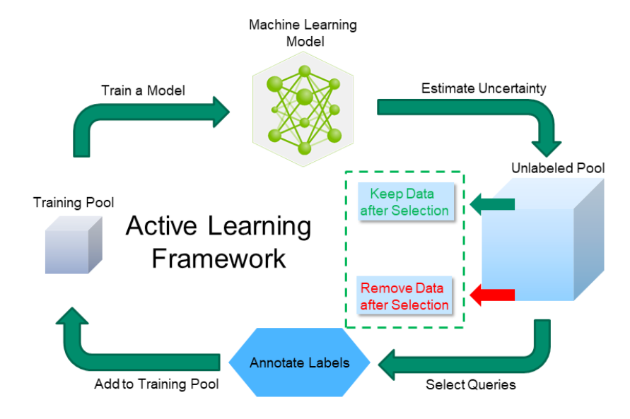

# DalMax

**Deep Active Learning Laboratory for UAV Weed Recognition**




## Overview

DalMax is the research codebase for a PhD project (UFMS, Brazil) on **Deep Active
Learning applied to UAV-based weed recognition in precision agriculture**. It
implements and compares acquisition (query) strategies for training a deep
classifier (ResNet50) under a limited annotation budget, on both a domain dataset
(`daninhas_full`, UAV weed image patches) and CIFAR-10 as a secondary benchmark.

The main scientific contribution is **RNHAL (Randomized Network-guided
Hierarchical Active Learning)**. RNHAL combines two stages:

1. A **randomized-network spatio-spectral representation module**, instantiated
   through the **SSRAE** formulation (see
   [`phd_files/artigo-original-tecnica-ssrae-manuscript.pdf`](phd_files/artigo-original-tecnica-ssrae-manuscript.pdf)
   and `dalmax/tools/SSRAE/`). For an image `x`, closed-form randomized autoencoders
   produce a spatial signature per channel (`Θ_R`, `Θ_G`, `Θ_B`) and a spectral
   signature per adjacent channel pair (`Ω_RG`, `Ω_GB`, `Ω_BR`); the final embedding
   is conceptually their concatenation `Φ(x) = [Θ_R, Θ_G, Θ_B, Ω_RG, Ω_GB, Ω_BR]`,
   encoding intra-channel spatial structure (`Θ_R, Θ_G, Θ_B`) and inter-channel
   spectral dependency (`Ω_RG, Ω_GB, Ω_BR`). **Implementation note (verified
   2026-08-23)**: the actual vector produced by `dalmax/tools/SSRAE/extractor.py` is
   row-interleaved, not laid out as two contiguous halves — naive slicing such as
   `emb[:len(emb)//2]` does **not** recover the spatial-only signatures. See
   `.specs/experiments/ablation-study.md` §6.1 for the corrected slicing used by the
   representation ablation.
2. A **hierarchical k-means batch selection mechanism** (`dalmax/tools/SSL/`) that
   recursively partitions the embedding space of the unlabeled pool and samples the
   query batch across the induced hierarchy, aiming for batches that are both
   informative and structurally diverse rather than redundant in visually dense
   regions.

The full formal definition is in
[`phd_files/Active_Learning_Mario/method_full.tex`](phd_files/Active_Learning_Mario/method_full.tex);
the paper under revision is
[`phd_files/Artigo_melhorias_Active_Learning_Mario.pdf`](phd_files/Artigo_melhorias_Active_Learning_Mario.pdf).

For the project's specifications, architecture, and experiment protocols, see
[`.specs/00-overview.md`](.specs/00-overview.md) and [`.specs/README.md`](.specs/README.md).

## Implemented query strategies

These are the exact `--strategy_name` choices exposed by `trainer.py`.

**Uncertainty-based**
- **Random Sampling** — select samples randomly (baseline).
- **Least Confidence** — select samples where the model is least confident [1].
- **Margin Sampling** — select samples where the margin between the two most
  likely classes is smallest [2].
- **Entropy Sampling** — select samples where the prediction entropy is highest [3].
- **Least Confidence / Margin / Entropy Sampling (Dropout)** — MC-dropout variants
  of the above, estimating uncertainty via stochastic forward passes [4].
- **BALD Dropout** — Bayesian Active Learning by Disagreement, using MC-dropout to
  estimate epistemic uncertainty [4].

**Diversity / representation-based**
- **KMeans Sampling** — select samples representative of feature-space clusters [5].
- **KCenter Greedy** — core-set selection minimizing the covering radius over the
  labeled + unlabeled pool [5].

**Adversarial**
- **Adversarial BIM** — select samples closest to the decision boundary via the
  Basic Iterative Method [6].
- **Adversarial DeepFool** — select samples with the smallest adversarial margin,
  estimated via DeepFool [6].

**Proposed RNHAL family (SSRAE / VCTex representation + k-means selection)**
- **SSRAE KMeans Sampling** — flat k-means over SSRAE spatio-spectral embeddings.
- **VCTex KMeans Sampling** — flat k-means over VCTex texture embeddings.
- **SSRAE KMeans HC Sampling** — hierarchical k-means (RNHAL) over SSRAE embeddings.
- **VCTex KMeans HC Sampling** — hierarchical k-means (RNHAL) over VCTex embeddings.

See [`.specs/experiments/experimental-protocol.md`](.specs/experiments/experimental-protocol.md)
for the exact protocol (seeds, budgets, metrics) and
[`.specs/experiments/ablation-study.md`](.specs/experiments/ablation-study.md) for the
ablation design that isolates each RNHAL stage.

## Installation

DalMax is **Poetry-only** — the pip/`requirements.txt` install path was retired
(2026-08-23), on every machine (dev notebook, lab machine, or Colab). See
[ADR 0001](.specs/adr/0001-adopt-poetry.md) and its amendment for why.

### 1. Prerequisites

- Python **3.10–3.12** (upper-bounded by the `torch==2.5.0` pin). Check with:
  ```bash
  python3 --version
  ```
- `git`.

### 2. Install Poetry

Recommended — via [`pipx`](https://pipx.pypa.io/) (keeps Poetry isolated from
any project virtualenv):

```bash
sudo apt install pipx
pipx ensurepath
pipx install poetry
```

Alternative — the official installer:

```bash
curl -sSL https://install.python-poetry.org | python3 -
```

Verify:

```bash
poetry --version   # this project was developed against Poetry 2.x
```

### 3. Clone and install

```bash
git clone https://github.com/MarioCarvalhoBr/dalmax-deep-active-learning-python.git
cd dalmax-deep-active-learning-python
poetry install
```

`poetry install` resolves `pyproject.toml`/`poetry.lock` and creates an
in-project virtualenv at `./.venv` (`poetry.toml`'s `in-project = true`). On
Linux x86_64 this installs `torch==2.5.0` from the CUDA 12.4 wheel index
pinned in the lockfile — it also works on CPU-only machines (torch's CUDA
build falls back to CPU when no GPU/driver is present), it is just a large
download (~2.5 GB total). Dependency versions are exact-pinned in
`pyproject.toml` for reproducibility (research lab, not a library).

### 4. Run

```bash
poetry run python trainer.py --dir_results results/dalmax1/ \
    --params_json files_config/benchmark/params_df_gpu_0.json \
    --dataset_name DANINHAS --strategy_name SSRAEKmeansHCSampling \
    --n_query 100 --n_init_labeled 100 --n_round 8 --seed 1 --device cuda
```

`poetry run <cmd>` (recommended) runs `<cmd>` inside the project's virtualenv
without activating it — use this form for every command in this README. To
activate the virtualenv directly instead: `poetry env activate` (Poetry 2.x
prints the exact activation command for your shell) or, since the venv is
in-project, `source .venv/bin/activate`.

### 5. Dev commands

```bash
make setup            # poetry install
make lint             # ruff check
make test             # pytest (fast tests only)
make smoke            # true end-to-end micro-dataset run (trainer.py, CPU) + fast tests
make smoke-ablations  # CPU smoke test for all 11 Phase 3 ablation configs
```

### 6. Lab machine

Same Poetry steps as above (`pipx install poetry` once per machine, then
`poetry install` after each `git pull`), then run the benchmark/ablation
scripts through `poetry run`:

```bash
poetry run bash scripts/benchmark/run_pipe_gpu_0.sh   # GPU 0, results/dalmax1/
poetry run bash scripts/benchmark/run_pipe_gpu_1.sh   # GPU 1, results/dalmax2/
poetry run bash scripts/ablations/run_ablation_gpu_0.sh
poetry run bash scripts/ablations/run_ablation_gpu_1.sh
```

(The scripts themselves already invoke `poetry run python` internally, so
`bash scripts/benchmark/run_pipe_gpu_0.sh` also works — the `poetry run bash`
wrapper above is shown for consistency with "everything through `poetry
run`".)

For the full step-by-step operator guide (one-time setup, dataset transfer,
sanity checks, `tmux` launch, monitoring, failure re-runs, and results
collection), see **[`LAB_RUNBOOK.md`](LAB_RUNBOOK.md)**. It is also wired into
`make` as a handful of dedicated targets: `make lab-setup`, `make lab-check`,
`make ablations-gpu0`/`make ablations-gpu1`/`make ablations-all`,
`make ablation-report`, `make benchmark-gpu0`/`make benchmark-gpu1`, and
`make micro-dataset`.

### CUDA

Training on `daninhas_full`/CIFAR10 with `torch==2.5.0` / `torchvision==0.20.0`
targets **CUDA 12.4** on the lab GPUs. No GPU is required for local development,
smoke tests, or CPU-only strategies.

## Datasets

### daninhas_full (primary)

UAV weed image patches, 5 classes, `train/`/`test/` split:

```
DATA/
    daninhas_full/
        train/
            DATASET_BRACHIARIA/
            DATASET_COLONIAO/
            DATASET_GRAMINEA/
            DATASET_MAMONA/
            DATASET_OUTRAS_FOLHAS_LARGAS/
        test/
            DATASET_BRACHIARIA/
            DATASET_COLONIAO/
            DATASET_GRAMINEA/
            DATASET_MAMONA/
            DATASET_OUTRAS_FOLHAS_LARGAS/
```

`DATA/` is treated as immutable, read-only input (see
[`.claude/rules/data-safety.md`](.claude/rules/data-safety.md)); it is not
distributed in this repository. See
[`.specs/research-rules/dataset-protocol.md`](.specs/research-rules/dataset-protocol.md)
for class definitions and any known imbalance notes.

### CIFAR-10 (secondary benchmark)

```bash
mkdir -p DATA
# Download DATA_CIFAR10.zip:
# https://drive.google.com/file/d/1xNQS9QngkoxOPyQhtG6PzbAr9b83Bmk7/view?usp=sharing
unzip DATA_CIFAR10.zip -d DATA
```

Expected layout:

```
DATA/
    DATA_CIFAR10/
        train/
            0/  1/  2/  ...  9/
        test/
            0/  1/  2/  ...  9/
```

## Usage

Entry point: `trainer.py` (renamed from the historical `demo.py` on 2026-08-23) — as of the Phase 2 core refactor, a thin shim that calls
`dalmax.cli.main()` (see [`.specs/architecture/refactor-plan.md`](.specs/architecture/refactor-plan.md)
Phase 2); every flag and results-directory convention below is unchanged, plus two additive flags.
Example (RNHAL / SSRAE hierarchical strategy on the weed dataset):

```bash
poetry run python trainer.py \
    --dir_results results/dalmax1/ \
    --params_json files_config/benchmark/params_df_gpu_0.json \
    --dataset_name DANINHAS \
    --strategy_name SSRAEKmeansHCSampling \
    --n_query 100 \
    --n_init_labeled 100 \
    --n_round 8 \
    --seed 1 \
    --device cuda
```

CLI arguments: `--dir_results`, `--params_json`, `--seed`, `--n_init_labeled`,
`--n_query`, `--n_round`, `--dataset_name {CIFAR10,DANINHAS}`, `--strategy_name`
(one of the strategies listed above, plus `RepresentationStrategy` — see below),
and two flags added in the Phase 2 core refactor:

- `--device {auto,cuda,cpu}` (default `auto`, resolving to `cuda` iff available) —
  which device the network and any embedding/selection computation runs on.
- `--embedding_variant {full,spatial,spectral}` (default: no override) — overrides
  the params JSON's `embedding.variant` for the SSRAE extractor, letting one params
  JSON serve all three representation-ablation variants via the CLI instead of
  three separate files.

### `RepresentationStrategy`: the generic embedding + selection strategy

`SSRAEKmeansSampling`, `VCTexKmeansSampling`, `SSRAEKmeansHCSampling`, and
`VCTexKmeansHCSampling` are unchanged from a CLI point of view, but are now all
served under the hood by one class,
`dalmax.query_strategies.representation.RepresentationStrategy`, composed from an
`EmbeddingProvider` (`dalmax/embeddings/`: `ssrae`, `vctex`, or `resnet_imagenet`)
and a `SelectionStrategy` (`dalmax/selection/`: `flat_closest`, `flat_proportional`,
or `hierarchical`) — see
[`.specs/adr/0005-representation-strategy-and-registries.md`](.specs/adr/0005-representation-strategy-and-registries.md).
`--strategy_name RepresentationStrategy` exposes this composition directly: the
`(extractor, selection method)` pair is read from the params JSON's per-dataset
`"embedding"`/`"selection"` blocks (see the params JSON schema below) instead of
being pinned to one of the four legacy presets. This is what
[`.specs/experiments/ablation-study.md`](.specs/experiments/ablation-study.md)'s
three sub-studies drive — e.g. an SSRAE `spatial`/`spectral` embedding variant, a
`resnet_imagenet` embedding with hierarchical selection, or an SSRAE embedding with
the new `flat_proportional` selection.

## Inference tools

New 2026-08-23 alongside a fix for a confirmed bug: `trainer.py` (via
`dalmax.query_strategies.base.Strategy.save_model`) used to save the trained model's *class*, not
its trained weights — every `saved_model.pth` produced before this fix (including every run under
`results/dalmax1/`/`results/dalmax2/`) is a ~900-byte pickled class reference with **no weights,
and cannot be recovered**; see [`.specs/quality/known-issues.md`](.specs/quality/known-issues.md)
KI-22 and [`.specs/adr/0006-checkpoint-format-and-inference-tools.md`](.specs/adr/0006-checkpoint-format-and-inference-tools.md).
`trainer.py` now writes a self-describing `dalmax-checkpoint` (`dalmax/models/checkpoint.py`:
weights + `model_name`/`n_classes`/`class_names`/`img_size`/provenance), and three new tools
consume it — all preprocessing (resize, normalization) is read from the same code training used,
never re-derived, so predictions here always match what a real run would have recorded.

### `loader.py` — inspect a checkpoint

```bash
poetry run python loader.py --model results/dalmax1/.../saved_model.pth
```

Prints format/version, `model_name`/`n_classes`/`class_names`/`img_size`, provenance (strategy,
seed, dataset, git commit, torch version, save timestamp), total/trainable parameter counts, a
per-top-level-module parameter breakdown, file size, and a CPU dummy-forward sanity check. On a
legacy pre-2026-08-23 checkpoint, prints a clear error instead of a raw unpickling traceback.

### `predict.py` — run a checkpoint on image(s)

```bash
# One image:
poetry run python predict.py --model results/dalmax1/.../saved_model.pth \
    --image DATA/daninhas_full/test/DATASET_GRAMINEA/some_image.jpg

# A whole folder (searched recursively):
poetry run python predict.py --model results/dalmax1/.../saved_model.pth \
    --dir DATA/daninhas_full/test/DATASET_GRAMINEA --out results/predictions/
```

Writes `predictions.csv` (`Image Index,Predicted Class,Confidence,Path`, plus one probability
column per class) and a `<stem>.pred.json` sidecar per image (full per-class probabilities +
checkpoint metadata) into `--out` (default: alongside the input). `--device {auto,cpu,cuda}`
mirrors `trainer.py`'s flag.

### `gui.py` — interactive mini-app

```bash
poetry run python gui.py
```

A `tkinter` app: load a model, select image(s) or a folder, run prediction into a results table,
click a row to preview that image with its per-class probabilities, and export the same CSV
`predict.py` writes. Runs on CPU by default; `dalmax/inference/gui.py`'s `main()` is the only place
that touches `tkinter`, so `import dalmax.inference.gui` is safe in a headless environment.

### Params JSON schema

Hyperparameters are keyed by dataset name (see `files_config/benchmark/params_df_gpu_0.json` /
`files_config/benchmark/params_df_gpu_1.json`, one file per lab GPU). The schema below is unchanged from
before the Phase 2 refactor; `dalmax/config/loader.py` reads it exactly as shown —
existing params JSON files need no edits.

```json
{
  "DANINHAS": {
    "data_dir": "DATA/daninhas_full/",
    "n_epoch": 10,
    "n_drop": 10,
    "n_classes": 5,
    "train_args": { "batch_size": 256, "num_workers": 4 },
    "test_args": { "batch_size": 256, "num_workers": 4 },
    "optimizer_args": { "lr": 0.05, "momentum": 0.3 },
    "config_kmh": {
      "n_clusters": [600, 200, 100],
      "n_levels": 3,
      "sample_sizes": [30, 15, 2]
    }
  },
  "CIFAR10": {
    "data_dir": "DATA/DATA_CIFAR10/",
    "n_epoch": 20,
    "n_drop": 10,
    "n_classes": 10,
    "train_args": { "batch_size": 64, "num_workers": 1 },
    "test_args": { "batch_size": 1000, "num_workers": 1 },
    "optimizer_args": { "lr": 0.05, "momentum": 0.3 }
  }
}
```

`config_kmh` (hierarchical k-means config, only needed by the `*HCSampling`
strategies) sets the number of clusters per hierarchy level (`n_clusters`), the
number of levels (`n_levels`), and how many samples are drawn per level
(`sample_sizes`).

**New, optional per-dataset keys (Phase 2 core refactor)**, consumed by
`--strategy_name RepresentationStrategy` (and by the legacy preset names, which
mostly ignore them — see the `RepresentationStrategy` section above):

```json
{
  "DANINHAS": {
    "...": "... same required keys as above ...",
    "embedding": {
      "extractor": "ssrae",
      "q": 13,
      "variant": "full"
    },
    "selection": {
      "method": "hierarchical",
      "hierarchy": { "n_clusters": [600, 200, 100], "n_levels": 3, "sample_sizes": [30, 15, 2] }
    }
  }
}
```

- `embedding.extractor`: `"ssrae"` (default) | `"vctex"` | `"resnet_imagenet"`.
- `embedding.q`: the extractor's hyperparameter — `13` for SSRAE, `[5, 17]` for
  VCTex, `null` for `resnet_imagenet` (fixed 2048-d penultimate layer, no `Q`).
  Defaults per-extractor if omitted; never falls back to SSRAE's `13` for VCTex.
- `embedding.variant`: `"full"` (default) | `"spatial"` | `"spectral"` — SSRAE
  only; slices the cached full embedding, never recomputes it.
- `selection.method`: `"flat_closest"` (today's `SSRAEKmeansSampling`/
  `VCTexKmeansSampling` behavior) | `"flat_proportional"` (new: random picks per
  cluster, proportional to cluster size, cluster count independent of the query
  budget) | `"hierarchical"` (today's `*HCSampling` behavior; requires
  `selection.hierarchy`).
- A dataset entry with a legacy `"config_kmh"` and no `"selection"` key is read
  as `selection = {"method": "hierarchical", "hierarchy": config_kmh}` —
  full backward compatibility, no existing file needs to change.

See [`.specs/experiments/ablation-study.md`](.specs/experiments/ablation-study.md)
for the exact `embedding`/`selection` values used by each ablation run.

### Results directory convention

`trainer.py` writes to:

```
{dir_results}/{dataset_folder}/SEED_{seed}/NQ_{n_query}_NIL_{n_init_labeled}_NR_{n_round}_NE_{n_epoch}/{strategy_name}/
```

containing `results.json`, `predictions.csv`, `confusion_matrix.pdf`,
`accuracy.pdf`/`precision.pdf`/`recall.pdf`/`f1_score.pdf`, `log-dalmax.log`, the
saved model checkpoint (`saved_model.pth`, a self-describing `dalmax-checkpoint` since
2026-08-23 — see [Inference tools](#inference-tools); checkpoints from before that fix contain no
weights and cannot be recovered), and (since the Phase 2 core refactor) `run_metadata.json`
— a full config snapshot plus the git commit hash, so any run is traceable back to
exactly what produced it. `results.json` also gained `all_precision_macro`/
`all_recall_macro`/`all_f1_macro` alongside the unchanged weighted metrics. See
[`.specs/experiments/experimental-protocol.md`](.specs/experiments/experimental-protocol.md).

## Execution environments

DalMax is developed and run across three environments:

1. **Local dev notebook** — 16 GB RAM, no GPU, Python 3.12, Poetry. Used for coding,
   CPU smoke tests on tiny subsets, and report generation.
2. **Lab machine (primary training)** — 2× NVIDIA GPUs, 10 GB each. Workflow: push
   from the notebook, pull on the lab machine, run `scripts/benchmark/run_pipe_gpu_0.sh` /
   `scripts/benchmark/run_pipe_gpu_1.sh` (one params JSON per GPU), results come back via git or copy.
3. **Google Colab Pro (secondary/burst)** — single GPU, session-limited; a hybrid
   layout (repo + `.venv` + dataset on the runtime's local disk, `results/`
   symlinked to Drive so artifacts survive a disconnect) via `make colab-setup` /
   `make ablations-colab`.

Details, decision matrix, and the Colab checklist:
[`.specs/infrastructure/execution-environments.md`](.specs/infrastructure/execution-environments.md).
For the lab machine specifically, see **[`LAB_RUNBOOK.md`](LAB_RUNBOOK.md)**
for the operator-facing step-by-step guide. For Colab, see
**[`COLAB_RUNBOOK.md`](COLAB_RUNBOOK.md)** for the numbered-notebook-cell guide,
or open the runnable notebook directly:
[`notebooks/colab_runbook.ipynb`](notebooks/colab_runbook.ipynb) —

[](https://colab.research.google.com/github/MarioCarvalhoBr/dalmax-deep-active-learning-python/blob/main/notebooks/colab_runbook.ipynb)

## Development

This project uses a Claude Code multi-agent setup for coding sessions — see
[`CLAUDE.md`](CLAUDE.md) for the operational guide, [`.claude/`](.claude/) for
agents/commands/rules/skills, and [`.specs/`](.specs/) for the source-of-truth
specifications.

```bash
make setup         # poetry install
make lint          # ruff check
make format        # ruff format
make test          # pytest (fast tests only)
make smoke         # true end-to-end micro-dataset run (trainer.py, CPU) + fast tests
make smoke-ablations  # CPU smoke test for all 11 Phase 3 ablation configs
```

## Repository layout

```
dalmax-deep-active-learning-python/
├── trainer.py                 # training CLI entry point — thin shim, calls dalmax.cli.main()
├── predict.py                 # inference CLI: run a saved_model.pth on image(s)
├── loader.py                  # inference CLI: inspect a saved_model.pth checkpoint
├── gui.py                     # inference tkinter mini-app — thin shim, calls dalmax.inference.gui.main()
├── dalmax/                    # the ONE package — all Python source lives here (Phase 4 complete)
│   ├── cli.py                 # argparse -> ExperimentConfig -> ExperimentRunner.run()
│   ├── config/                # schema.py (typed dataclasses), loader.py (params JSON -> config)
│   ├── seeding.py             # single place that seeds random/numpy/torch
│   ├── logging_utils.py       # module-level singleton logger
│   ├── data/                  # datasets.py (Data), handlers.py (torch Dataset wrappers),
│   │                          #   loaders.py (get_DANINHAS/get_CIFAR10), registry.py
│   ├── models/                # base.py (DeepLearning), daninhas_resnet50.py, cifar10_cnn.py,
│   │                          #   checkpoint.py (save/load/describe_checkpoint), registry.py
│   ├── inference/             # predictor.py (Predictor), export.py (CSV writer), gui.py (tkinter)
│   ├── query_strategies/      # base.py (Strategy) + 12 baseline modules (random_sampling.py,
│   │                          #   least_confidence.py, margin_sampling.py, entropy_sampling.py,
│   │                          #   *_dropout variants, kmeans_sampling.py, kcenter_greedy.py,
│   │                          #   bayesian_active_learning_disagreement_dropout.py, adversarial_bim.py,
│   │                          #   adversarial_deepfool.py) + representation.py + STRATEGY_REGISTRY
│   ├── embeddings/            # EmbeddingProvider: ssrae, vctex, resnet_imagenet + keyed cache
│   ├── selection/             # SelectionStrategy: flat_closest, flat_proportional, hierarchical
│   ├── experiment/            # runner.py (round loop), reporter.py (plots/JSON/CSV), run_metadata.py
│   ├── reporting/              # cross-run aggregation: extract_confusion_matrices.py, chunk_results.py,
│   │                          #   average_confusion_matrices.py, average_results.py,
│   │                          #   build_method_metrics.py, plot_results_dir.py, ablation_report.py
│   └── tools/                 # vendored third-party code (unchanged contents, Meta-licensed for SSL/)
│       ├── SSRAE/             # randomized-network spatio-spectral extractor
│       ├── VCTex/              # alternative color-texture representation
│       └── SSL/                # hierarchical k-means selection
├── files_config/
│   ├── params_micro.json      # CPU smoke-test params (make smoke)
│   ├── ablations/              # Phase 3 ablation-study params (6.1/6.2/6.3 + micro/ variants)
│   └── benchmark/              # RNHAL reference-benchmark params (one file per lab GPU)
│       ├── params_df_gpu_0.json
│       └── params_df_gpu_1.json
├── scripts/
│   ├── make_micro_dataset.py  # generates DATA/daninhas_micro/ for make smoke
│   ├── ablations/              # Phase 3 ablation run/smoke scripts (poetry run python)
│   └── benchmark/              # RNHAL reference-benchmark batch runners (poetry run python)
│       ├── run_pipe_gpu_0.sh
│       ├── run_pipe_gpu_1.sh
│       └── ...                 # older baseline-strategy scripts, kept for history
├── DATA/                      # datasets (gitignored, immutable)
├── results/                   # experiment outputs (gitignored)
├── phd_files/                 # PhD documents, paper LaTeX sources, references
├── .claude/                   # multi-agent config: agents, commands, rules, skills
├── .specs/                    # specifications: architecture, experiments, ADRs
├── tests/                     # pytest suite (imports, registry, SSRAE layout, dalmax/ modules)
├── CLAUDE.md                  # operational guide for Claude Code sessions
├── AGENTS.md                  # tool-agnostic mirror of CLAUDE.md
└── Makefile
```

`core/` and `utils/` — the pre-Phase-4 two-package split — no longer exist; everything moved into
`dalmax/` in Phase 4 (`.specs/architecture/refactor-plan.md`, ADR 0002's final amendment). See
[`.specs/architecture/current-state.md`](.specs/architecture/current-state.md) for the full,
per-module current-state map.

## Roadmap

The codebase was refactored in phases to make the ablation study
(representation ablation, hierarchy ablation, RNHAL-stage-contribution ablation)
a matter of configuration rather than new code:

**Phase 1 — Safety net (done) → Phase 2 — Core refactor (done) → Phase 3 — Ablations (config/code done; lab-machine runs outstanding) → Phase 4 — Polish (done: package consolidated into `dalmax/`, dead code deleted).**

Full phase plan and acceptance criteria:
[`.specs/architecture/refactor-plan.md`](.specs/architecture/refactor-plan.md).
Ablation design: [`.specs/experiments/ablation-study.md`](.specs/experiments/ablation-study.md).

## License

DalMax is released under the MIT License. See [LICENSE](LICENSE).

## Citing

If you use this code in your research or applications, please consider citing the
repository:

```bibtex
@misc{Carvalho2024dalmax,
  author       = {Mário de Araújo Carvalho},
  title        = {DalMax: Framework for Deep Active Learning Approaches},
  howpublished = {\url{https://github.com/MarioCarvalhoBr/dalmax-deep-active-learning-python}},
  month        = {dec},
  year         = {2024},
  note         = {Available on GitHub},
  annote       = {A Python framework for implementing and comparing deep active learning methods.}
}
```

This repository also contains the PhD qualification document presenting the
theoretical foundation and methodology behind DalMax/RNHAL:
[`phd_files/qualificacao-doutorado-mario-carvalho.pdf`](phd_files/qualificacao-doutorado-mario-carvalho.pdf).

```bibtex
@phdthesis{Carvalho2025qualificacao,
  author     = {Mário de Araújo Carvalho and Wesley Nunes Gonçalves},
  title      = {Deep Active Learning for Precision Agriculture: A Computational Approach},
  school     = {Universidade Federal de Mato Grosso do Sul, Faculdade de Computação},
  year       = {2025},
  month      = {mar},
  type       = {Qualificação de Doutorado},
  address    = {Campo Grande, MS, Brazil},
  note       = {PhD Qualification Examination},
  supervisor = {Wesley Nunes Gonçalves}
}
```

## Contact

- Author: Mário de Araújo Carvalho
- Email: mariodearaujocarvalho@gmail.com
- Advisor: Wesley Nunes Gonçalves (UFMS)
- Project: [https://github.com/MarioCarvalhoBr/dalmax-deep-active-learning-python](https://github.com/MarioCarvalhoBr/dalmax-deep-active-learning-python)

## Acknowledgements

This project is based on code from
[DeepAL: Deep Active Learning in Python](https://github.com/ej0cl6/deep-active-learning).
Please consider citing the corresponding publication, available
[here](https://arxiv.org/abs/2111.15258).

### References

[1] A Sequential Algorithm for Training Text Classifiers, SIGIR, 1994

[2] Active Hidden Markov Models for Information Extraction, IDA, 2001

[3] Active learning literature survey. University of Wisconsin-Madison Department of Computer Sciences, 2009

[4] Deep Bayesian Active Learning with Image Data, ICML, 2017

[5] Active Learning for Convolutional Neural Networks: A Core-Set Approach, ICLR, 2018

[6] Adversarial Active Learning for Deep Networks: a Margin Based Approach, arXiv, 2018
