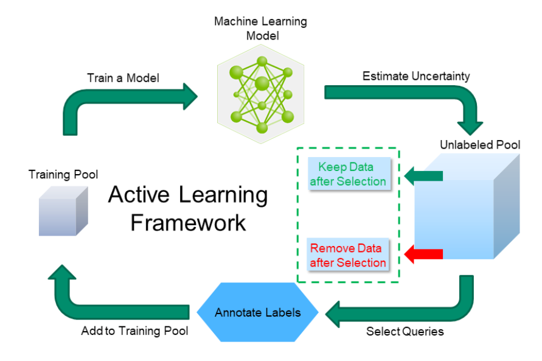

# DalMax - Framework to Deep Active Learning Approaches
Repository of resources used in my doctoral studies in the area of ​​Deep Active Learning



## Methodology Overview
The Framework to Deep Active Learning Approaches for Maximal Information Gain (DalMax) is a framework that aims to select the most informative samples for training a deep learning model. The DalMax framework is based on heuristic strategies that select the samples that maximize the information gain of the model. The DalMax framework is composed of this heuristic strategies:
- **Uncertainty Sampling**: Calculate the entropy or confidence margin to select samples.
- **Diversity Sampling**: Use clustering (e.g., K-means) to select samples that represent the diversity of the dataset.
- **Query by Committee (QBC)**: Train multiple models and select the samples where there is the greatest disagreement between them.
- **Core-Set Selection**: Use optimization methods such as K-Center to select subsets that effectively cover the data space.
- **Adversarial Active Learning**: Generate adversarial samples to identify model weaknesses.
- **Reinforcement Learning for Active Learning**: Apply RL to learn sample selection strategies. This is not implemented in this repository.
- **Expected Model Change**: Choose samples that, when labeled, are expected to cause the greatest change in the model.
- **Bayesian Active Learning**: Use Bayesian methods to model uncertainty and select samples that maximize information gain.

## Dependencies
This project depends on the following libraries:
- Python 3.9
- TensorFlow 2.11.0
- CUDA 11.7
- Numpy
- Scikit-learn
- Matplotlib
- Seaborn


## Evnironment Setup
To install the necessary dependencies, run the following command:
 - Create a virtual environment with Python 3.9.
    ```bash
        conda create --name dalmax_gpu python=3.9
        conda activate dalmax_gpu
    ```

### Install TensorFlow
#### For GPU users
- Install CUDA
    To install CUDA, follow the instructions on the NVIDIA website: [https://developer.nvidia.com/cuda-downloads](https://developer.nvidia.com/cuda-downloads). Select the version compatible with your GPU and operating system. We recommend using CUDA 11.7.
    IF DONT HAVE GPU, YOU CAN USE THE CPU VERSION. SEE BELOW.
```bash
    pip install tensorflow[and-cuda]
```
#### For CPU users
```bash
    pip install tensorflow
```
#### Dependencies
 - Install the dependencies on `requirements.txt`.
    ```bash
        pip install -r requirements.txt
    ```
 - Or install the dependencies manually.
    ```bash
        pip install numpy
        pip install scikit-learn
        pip install matplotlib
        pip install seaborn
    ```

## Usage

### Dataset
This project uses the [CIFAR 10](https://www.cs.toronto.edu/~kriz/cifar.html) dataset. 
Download the dataset zip CIFAR10 from [https://drive.google.com/file/d/1xNQS9QngkoxOPyQhtG6PzbAr9b83Bmk7/view?usp=sharing](https://drive.google.com/file/d/1xNQS9QngkoxOPyQhtG6PzbAr9b83Bmk7/view?usp=sharing). It must be unzipped inside the `DATA` folder.

#### Steps dataset
 - Create folder DATA in root of project.
    ```bash
        mkdir DATA
    ```
 - Download the dataset zip CIFAR10 from [https://drive.google.com/file/d/1xNQS9QngkoxOPyQhtG6PzbAr9b83Bmk7/view?usp=sharing](https://drive.google.com/file/d/1xNQS9QngkoxOPyQhtG6PzbAr9b83Bmk7/view?usp=sharing).
 - Unzip the dataset inside the `DATA` folder.
    ```bash
        unzip DATA_CIFAR10.zip -d DATA
    ```

Structure of the dataset:
```
DATA/
    DATA_CIFAR10/
        train/
            0/
                1000.png
                1001.png
                ...
            1/
            2/
            ...
            8/
            9/
        test/
            0/
                1000.png
                1001.png
                ...
            1/
            2/
            ...
            8/
            9/
```

### Training Deep Active Learning Models
To train the models, run the following command:
```bash
    python tools/train_al.py --dir_train YOUR_DATASET/train/ --dir_test YOUR_DATASET/test/ --dir_results results/ --type uncertainty_sampling --batch_size 10 --iterations 5 --test_size 0.9 --mult_gpu True
```
#### Parameters
- `dir_train`: Path to the training dataset.
- `dir_test`: Path to the test dataset.
- `dir_results`: Path to save the results.
- `type`: Active learning strategy. Options: `uncertainty_sampling`, `query_by_committee`, `diversity_sampling`, `core_set_selection`, `adversarial_sampling`, `reinforcement_learning_sampling`, `expected_model_change`, `bayesian_sampling`.
- `batch_size`: Number of samples to be selected in each iteration.
- `iterations`: Number of iterations.
- `test_size`: Proportion of the test dataset.
- `mult_gpu`: Use multiple GPUs. Optional. If `True`, the model is trained with multiple GPUs. If not informed, the model is trained with a single GPU.

#### Results
The results are saved in the `results` folder. The following files are generated:

- `selected_images/`: Folder with the selected images in each iteration per class.
- `confusion_matrix.pdf`: Confusion matrix of Deep Active Learning model. This is valid only for the active learning strategies that use the test dataset.
- `final_accuracy.txt`: Final accuracy of the Deep Active Learning model. This is valid only for the active learning strategies that use the test dataset.
- `infos.txt`: Information about the training process.
- `query_by_committee_al_model.h5`: Deep Active Learning model. This is valid only for the active learning strategies that use the test dataset.
- `training_accuracy_plot.pdf`: Training accuracy plot.
- `training_loss_plot.pdf`: Training loss plot.

### Training Deep Learning Models
To train the models, you can select on RANDOM or ACTIVE mode. In the RANDOM mode, the model is trained with random samples. In the ACTIVE mode, the model is trained with the samples selected by the active learning strategy. The following command shows how to train the model in the RANDOM mode:

#### Random Mode
```bash
    python tools/train.py --dir_train YOUR_DATASET/train/ --dir_test YOUR_DATASET/test/ --dir_results results/ --type random --epochs 10 --mult_gpu True
```

#### Active Mode
```bash
    # Example of training with the selected images by the core set selection strategy
    python tools/train.py --dir_train YOUR_RESULTS_FOLDER/active_learning/core_set_selection/selected_images/ --dir_test YOUR_DATASET/test/ --dir_results results/ --type train --epochs 10 --mult_gpu True
```

Parameters:
- `dir_train`: Path to the training dataset.
- `dir_test`: Path to the test dataset.
- `dir_results`: Path to save the results.
- `type`: Training mode. Options: `random`, `train`.
- `epochs`: Number of epochs.
- `mult_gpu`: Use multiple GPUs. Optional. If `True`, the model is trained with multiple GPUs. If not informed, the model is trained with a single GPU.


### Testing Deep Learning Models
To test the models, run the following command:
```bash
    python tools/test.py --dir_test YOUR_DATASET/test/ --dir_model results/YOUR_model.h5
```
Parameters:
- `dir_test`: Path to the test dataset.
- `dir_model`: Path to the model.
  
## License

DalMax is under the MIT License. See the [LICENSE](LICENSE) file for more details.

## Contact

- Author: Mário de Araújo Carvalho
- Email: mariodearaujocarvalho@gmail.com
- Project: [https://github.com/MarioCarvalhoBr/dalmax-framework-deep-active-learning-python](https://github.com/MarioCarvalhoBr/dalmax-framework-deep-active-learning-python)
